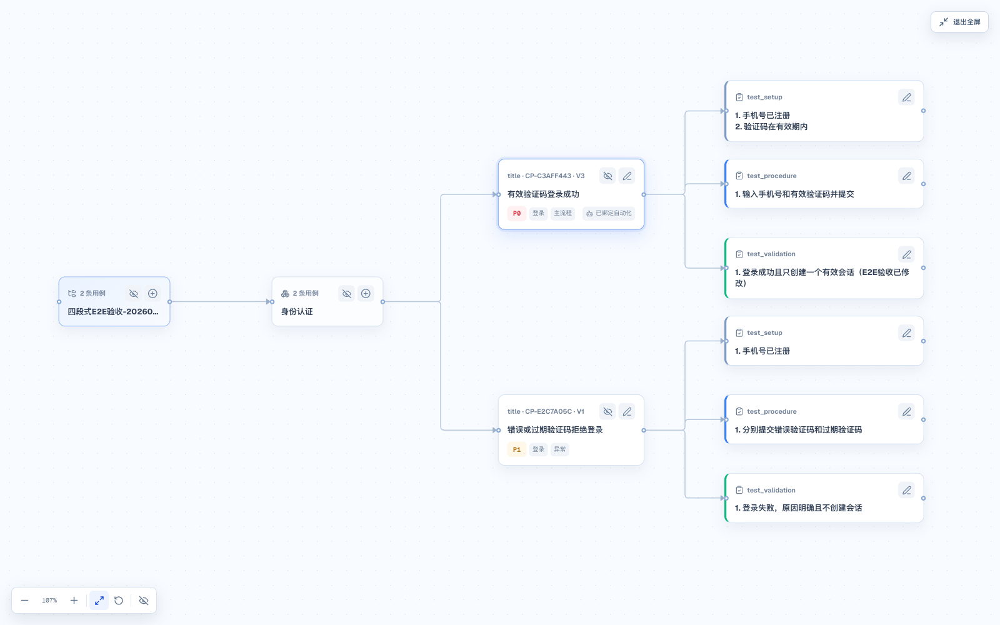
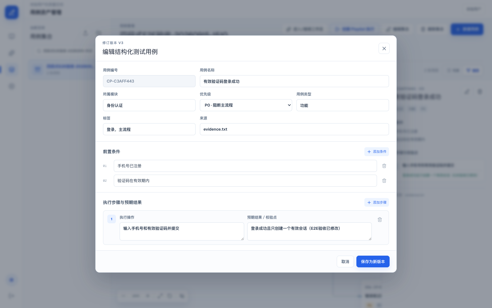
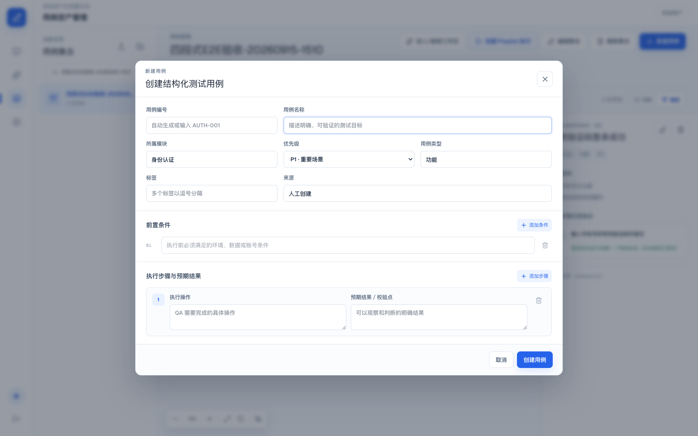

# 四段式用例生成与脑图端到端验收

> 验收日期：2026-09-15
>
> 验收集合：`四段式E2E验收-20260915-1510`
>
> 结论：核心产品链路通过；真实模型供应商调用需单独恢复后复验。

## 验收范围

本次从自然语言需求开始，覆盖结构化测试说明、候选生成、正式集合写入、脑图展示、节点修改、新建入口和自动化绑定标签。用例统一采用以下结构：

1. `title`
2. `test_setup`
3. `test_procedure`
4. `test_validation`

## 端到端结果

| 编号 | 验收项 | 结果 | 证据 |
| --- | --- | --- | --- |
| E2E-01 | 输入手机号验证码登录需求并生成结构化测试说明 | 通过 | 说明 V1 成功生成并经人工确认 |
| E2E-02 | 确认说明后生成候选用例 | 通过 | 生成 2 条候选，质量评分 100 |
| E2E-03 | 候选写入正式集合并创建 Revision | 通过 | 2 条用例写入集合 |
| E2E-04 | 脑图按四段结构展示 | 通过 | `title`、`test_setup`、`test_procedure`、`test_validation` 均可见 |
| E2E-05 | 从脑图节点进入编辑并保存 | 通过 | `test_validation` 修改后 Revision 从 V2 升至 V3，脑图同步刷新 |
| E2E-06 | 从集合或模块节点创建用例 | 通过 | 创建窗口打开且自动带入模块“身份认证” |
| E2E-07 | 自动化用例绑定标签 | 通过 | `automation_type=automated` 时显示“已绑定自动化” |
| E2E-08 | API、数据库和异步 Agent 串联 | 通过 | API ready、PostgreSQL/Redis healthy，Mock Agent 任务成功完成 |

## 关键截图

### 1. 四段式脑图和自动化标签



### 2. 从 validation 节点进入结构化编辑器



### 3. 从脑图模块节点创建新用例



## 自动化验证

浏览器验收脚本：`apps/web/e2e/four-section-mind-map-acceptance.spec.ts`

执行结果：

```text
1 passed (11.6s)
```

脚本断言了四段节点、自动化标签、编辑器中的 validation 值，以及从脑图创建用例时的模块预填。

## 已知问题与边界

首次使用配置的真实模型 `ark-code-latest` 执行时，任务停在外部模型响应阶段，API、SSE、Outbox、PostgreSQL 和 Redis 均正常。为完成可重复的产品链路验收，后续步骤使用 `CASEPILOT_AGENT_PROVIDER=mock`；因此本报告证明应用端到端编排和交互正确，不代表真实模型供应商链路已恢复。

另发现全屏脑图中点击编辑按钮后，编辑弹窗会在退出浏览器全屏时显示。非全屏脑图可直接打开弹窗；全屏场景仍可优化为自动退出全屏或在全屏节点内呈现编辑器。
