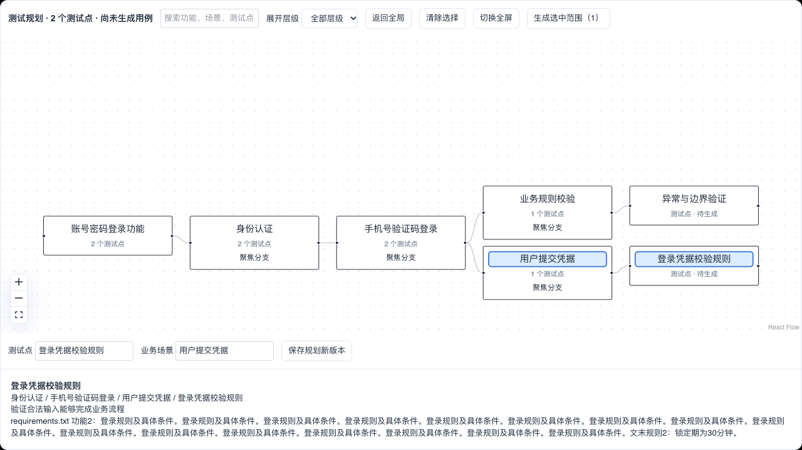

# 测试规划脑图与分支生成首批实现

日期：2026-10-08。实现范围：首个规划预览与分支生成闭环，以及修改时的任务附件依据。完整优化计划尚未全部完成。

## 已实现能力

结构化测试说明任务先生成可追溯的功能点与测试点，并保存在说明版本的 JSON 内容中，不创建用例候选。工作区自动显示规划脑图，说明与脑图共用这份数据。旧说明没有规划数据时继续展示原来的说明视图。

脑图路径为集合或测试对象、模块、功能、业务场景、测试点。用例生成后使用对应的多级模块路径组织正式脑图，解决用例直接堆在单层模块下的问题。支持功能概览、展开层级、搜索、分支聚焦、全屏和来源详情；可以编辑测试点名称、业务场景并保存为新说明版本。

确认接口验证说明版本和选中的测试点，冻结规划及证据快照。新生成路径复用已确认规划，逐测试点生成，不再重新生成整套功能点、测试点，也不使用原来的固定总量。用户指定数量时保留预算内结果，并对尚未生成的测试点给出警告。

不同分支分次生成时，已完成的其他分支候选保留；同一测试点重新生成时替换对应候选。候选沿用原有审阅、入库和 Revision 流程。规划编辑与确认使用工作区行锁和版本校验；生成正在执行时不允许通过编辑接口重置活动任务。

任务附件读取所有已解析的非重叠父块，不再应用 12 段和每段 800 字符限制。长输入按字符预算分批分析，保留资料来源。知识库参考资料仍按相关性检索。文档未就绪、已失效或没有正文时失败，不使用空正文冒充完整输入。

正式用例和候选修改都可以使用任务附件。短资料直接作为上下文，长资料逐批提取与选中用例相关的精确规则，然后交给已有修改差异流程；显式字段赋值仍遵从原有确定性处理。

## 数据与兼容

规划使用已有说明版本的 JSON 存储，没有新建平行的用例存储体系。功能点和测试点基于内容生成稳定 ID；同一规划版本中的手工改名保留 ID。完全相同的功能和测试点跨资料批次合并，同时保留规则描述与来源。

新增迁移 `20261008_0027` 将用例 Revision 的模块路径上限从 160 扩展至 4000 字符，API 同步更新。部署新版本前需要执行迁移。回退时若存在超过旧限制的路径，迁移明确拒绝截断数据。

测试库从空库迁移到最新版本已通过。没有升级或部署现有运行环境。

## 验证结果

| 验证 | 结果 |
| --- | --- |
| API 与 Agent 测试 | 375 项通过，使用独立测试库 |
| 前端类型检查 | 通过 |
| 修改文件的前端静态检查 | 通过 |
| 前端生产构建 | 通过，保留现有的大文件体积提示 |
| 规划审阅端到端 | 规划阶段无候选；编辑生成新版本；旧版本确认返回冲突；单测试点生成、第二分支追加和两条候选入库通过 |
| 附件端到端 | 上传并解析 16 章文本；保存的证据超过 12 段、包含超过 800 字符的正文及末章规则；规划阶段仍无候选 |
| 修改资料单元验证 | 长文档所有批次均被检查，末批相关规则保留；供应商请求能携带任务资料 |

端到端使用 Mock Agent，验证的是页面、API、存储与任务编排，不证明真实模型能识别附件的所有需求或正确处理所有规则冲突。已有依赖弃用提示与一项既存的 Pydantic 枚举序列化警告不影响测试通过。

测试入口为 `apps/web/e2e/test-planning.spec.ts`、`apps/agent/tests/test_planning.py`、`apps/api/tests/test_test_planning.py`，并运行了现有 API 和 Agent 回归。

规划全屏截图使用 Mock 资料与输出，展示多层结构、分支选择、编辑和来源，不用于证明模型理解准确性。

## 后续实施范围

1. 将需求条目和规划节点升级为更完整的可编辑模型，支持节点增删、移动、显式排除及规则冲突状态；完善资料重新分析后的人工编辑保留。
2. 逐批持久化并展示未完成任务的候选、按分支恢复，以及限制预算的自动缺口修复。目前分批调用可利用既有阶段缓存，候选在任务完成时统一进入审阅。
3. 建立需求、测试点、正式用例之间的完整覆盖与版本影响关系。目前正式脑图使用业务路径，不能把路径分组或结构引用视为语义覆盖证明。
4. 增加资料版本比较，明确新增、修改、停用建议和范围外影响。目前附件已参与修改，但不提供完整的资料版本差异审阅。
5. 增加资料角色切换、逐页解析状态、复杂表格与图片质量反馈、1000 条以上的大规模性能验收及真实模型准确率评估。

目前任务附件默认作为本次依据，临时附件的保存和删除策略未改动。没有引入完整的功能开关发布体系。

## 部署及真实对话深度验收（2026-10-08 晚间更新）

已部署到本机日常环境：Web <http://localhost:3000>，API <http://localhost:8000>。
API、Agent、定时任务采用现有 Compose 环境，保留数据库及知识库卷；数据库由 0026 升级至 0027。前端使用 `vinext build` 的生产产物和本机常驻 `vinext start` 进程（不是 Docker Web 服务，也未配置开机自启）。更新前已备份数据库，备份位于本地 `output/deployment-acceptance-20261008/pre-deploy.dump`，不纳入版本控制。

本次使用配置的真实模型服务（`openai_compatible` / `real`），新对话界面选择 `ark-code-latest`。没有拦截或模拟网络响应。所有写入均在新建的验收集合内进行。

### 通过结果

共 **10 个真实浏览器场景通过**：首轮专项中 8 个通过，修复及脚本纠正后补充复验 2 个通过。首轮失败和中断记录保留，不计为通过。

- 首页新对话 → 自然语言需求 → 新建并确认集合 → 规划脑图：正式用例仍为 0。
- 确认规划 → 生成恰好 2 条候选 → 用户纳入：正式用例变为 2；模块路径至少四层，保留功能、场景和测试点。
- 查询当前集合：用例内容、版本和数量均不变。
- 同一对话追加 1 条密码重置用例：新规划、新候选、确认纳入后共 3 条；原两条完整保留。
- 修改新增用例标题：执行前确认，刷新后继续；采纳前正式数据不变，采纳后只改变目标用例。
- 删除取消：全部 3 条不变；再次删除并确认后恢复原两条，刷新仍一致。
- 修改范围澄清和缩小后须重新确认；结束确认任务不会生成变更。
- 内容条件不会扩大成整个模块；空前置条件、五步骤结构、前轮累计建议得以保留。
- 真实复合改写最终同时保存新标题和断网重试步骤，范围外用例不变。
- 部分采纳不被未选条目的版本变化阻断；无需改动的子集不丢失前轮结果。

主流程历时约 6.6 分钟，浏览器 `pageerror` 为 0。最终操作状态依次为：生成 completed、查询 completed、生成 completed、修改 completed、删除 cancelled、删除 completed。

验收对话：<http://localhost:3000/workbench/conversations/c0dd1c90-1cfa-47db-8022-df1c1bca2d82>。

### 本轮发现与修复

1. 空集合生成需求里的“保持未登录”被共用范围解析误认为保护既有资产的修改约束。修复为空集合生成不解析不存在的资产范围，完整保留需求交给规划。新增回归测试；相关范围测试 60 项通过，全部 API/Agent 测试 **376 项通过**。
2. Docker 构建上下文包含历史视频、临时文件和数据库备份，体积超过 2 GB。补充 `.dockerignore` 排除 `output`、`tmp`、测试输出，重建成功。
3. 旧复合修改脚本假定模型总是合并操作。实际模型允许把标题修改和步骤补充分成依赖任务；调整为逐项确认和采纳后检查最终全部结果，未放宽最终标题、重试步骤及非目标用例不变的断言。
4. 新主流程脚本校正新对话 URL 与集合 ID 的区别，以及最新确认按钮文案。

模型规划期间曾出现一次请求错误，重试后任务成功；因此本次结果证明功能联通，不代表模型服务始终无错误或延迟稳定。全文资料的复杂排版/OCR准确率、千节点性能和此前计划尚未实现的功能不在本轮通过范围内。

### 验证与证据

- 生产构建、TypeScript、新验收脚本 ESLint、差异空白检查通过。
- API/Agent：376 passed，6 条既有依赖/序列化警告。
- 最终健康检查：Web HTTP 200；API、Postgres、Redis 均为 ok。
- [首轮专项日志](../output/deployment-acceptance-20261008/real-e2e.log)
- [最终两项复验日志](../output/deployment-acceptance-20261008/crud-final.log)
- [后端全量测试日志](../output/deployment-acceptance-20261008/python-tests.log)
- 主流程截图、trace、逐轮响应与最终用例：`output/deployment-acceptance-20261008/crud-final/deployed-chat-crud-new-con-2666b-ery-→-add-→-modify-→-delete/`。
- 复现入口：`apps/web/e2e/deployed-chat-crud.spec.ts`、`modification-confirmation.spec.ts`、`rewrite-review-regressions.spec.ts`；设置 `CASEPILOT_REAL_ACCEPTANCE=1` 及上述 Web/API 地址后运行 Playwright。
