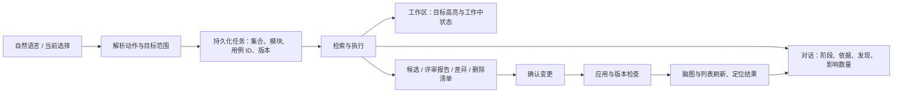

# AI 用例能力地图与对话—工作区映射评审

评审日期：2026-09-28。基线：9cb1b0a。
范围：对话指令、目标解析、任务编排、Agent 输入、候选/正式用例、变更确认、脑图/列表和任务恢复。
方法：静态代码链路审查；本报告未进行真实模型端到端验收，也未修改业务代码。“已实现”表示存在实现链路，不代表所有自然语言表达均已验证。

## 结论

当前是具有生成与变更确认能力的对话工作区，尚未形成完整的用例维护 Agent。优先问题是目标解析与任务状态：必须先确保“操作哪个集合、哪个模块、哪些用例”明确且两种视图一致，再扩展评审、查重、补全等能力。

## 当前能力地图

| 能力 | 当前实现 | 缺口 / 限制 |
|---|---|---|
| 自然语言生成 | 生成测试说明，确认后生成候选，再纳入正式集合 | 指定模块增量生成缺少可靠的模块范围和已有覆盖输入 |
| 修改测试说明 | 结合上一版说明与对话修改，版本确认 | 与正式用例修改是不同流程，用户需看清操作对象 |
| 修改正式用例 | 单条/多条逐条改写，生成字段差异，确认后创建修订 | 依赖先解析出目标；并非任意自然语言都能定位 |
| 修改候选用例 | 候选快照、版本、差异确认 | 候选与正式用例的目标标识和可用操作存在差异 |
| 删除正式用例 | 生成删除清单，确认后软删除，有审计记录 | 自然语言候选删除没有对等实现；选错范围仍会生成错误清单 |
| 查询用例 | 能返回当前集合的正式用例摘要 | 固定前 20 条，未落实模块、优先级等筛选，也没有完整分页 |
| 解释某条用例 | 已选用例可作为问答上下文，答案支持流式输出 | 未解析出模块目标时，不会自动把该模块完整用例送入问答 |
| review 模块 | 可在提供用例上下文后尝试通过问答评审 | 无独立评审任务、问题清单、严重程度、定位与处理状态 |
| 冗余检查 | 暂无独立能力链路 | 没有重复分组、相似依据、保留/合并建议及确认处理闭环 |
| 覆盖缺口分析 | 生成过程有测试点、增强与质量阶段 | 不等价于对现有模块的覆盖审计，没有需求—用例覆盖报告 |
| 模块级操作 | 支持结构化 module 目标并展开到用例 | 文本模块名识别苛刻；匹配完整字符串，不包含父模块后代 |
| 连续对话 | 有对话记忆、上下文、选中目标持久化 | 上次选择可能优先于本轮明确点名；上下文不是完整资产索引 |
| 单句多操作 | 有最多 3 个操作及依赖、继续执行机制 | 同一句各操作初始共用目标集合，不能可靠表达不同模块分工 |
| 脑图/列表同步 | 同用 visibleCases，应用后刷新数据 | 模块级任务高亮与候选目标在列表的映射不完整 |
| 执行过程展示 | 阶段名称、百分比、流式答案、终态、部分重试入口 | 缺少作用范围、已处理数量、发现和证据的完整任务日志 |
| 工作中状态 | 已有 running/review/applied 样式 | 依赖页面 busy、选中目标与提示文本；未完整绑定持久化任务 |
| 变更保护 | 差异确认、部分字段接受、修订冲突校验、软删除审计 | 未形成可见的批次回滚闭环；冲突恢复体验需单独验收 |

## 主要问题及证据

### P1：上次选中的对象会覆盖本轮明确点名的对象

`apps/web/components/case-workbench.tsx:790` 优先使用非空 selectedTargets，仅在没有选择时调用 targetsFromInstruction。先选 A，再输入“修改 B 的预期”，仍会向后端发送 A。确认差异能阻止直接写入，但生成的变更范围已经错误。

建议：本轮显式对象优先；与当前选择冲突时展示解析结果或澄清，禁止静默沿用旧对象。

### P1：模块自然语言和父模块范围解析不完整

`apps/web/components/case-workbench.tsx:464` 只识别完整用例编号/标题，以及 `模块「完整模块名」` 或中文弯引号形式。普通“review 支付模块”不能通过该解析器定位。`apps/api/src/casepilot_api/agent_router.py:39` 的操作草案只有 target_kind，没有解析后的模块标识；后端展开模块仍依赖请求已有 selectors。

`apps/api/src/casepilot_api/conversations.py:2490` 和 `:2520` 附近按 module 字符串精确匹配，不能把父模块自然扩展为所有子模块。

建议：服务端统一解析模块身份、别名及后代范围，返回解析依据、目标 ID、数量和歧义；脑图与列表共用结果。

### P1：一句话中的不同操作共用同一批目标

`apps/api/src/casepilot_api/conversations.py:2692` 为各 operation 写入相同 payload.targets 和 target_case_ids。比如“修改 A 模块并删除 B 模块”即使拆出两个意图，也没有逐操作独立解析目标的完整数据模型。

建议：每个操作必须持有独立 scope、resolved_ids、base_versions，分别确认影响范围。

### P1：按条件查询实际上返回集合前 20 条

`apps/api/src/casepilot_api/conversations.py:1247` 的 CASE_QUERY 分支直接读取集合、排序、limit(20)，没有应用请求的目标、模块或优先级。询问“查询支付模块 P0 用例”会获得并不对应问题的清单。

建议：执行可验证的结构化筛选，返回匹配总数、分页和定位动作；不能把固定截断的结果描述为完整查询。

### P1：刷新后修改任务的工作中状态和追踪不能恢复

`apps/web/components/case-workbench.tsx:522`、`:691` 只为 brief_drafting/generating 恢复 busy 与 watchGeneration。修改任务的 phase 保持 maintenance，刷新后不会沿该链路恢复监听。

此外 `:381` 将 busy 泛化为 running，applied 依赖 notice 字符串。问答、保存或其他操作也可能影响目标的工作中样式，缺少明确 failed/cancelled/conflict 状态。

建议：从服务端 operation/job 的状态恢复任务，而不是从页面 phase 和提示语推断。

### P2：模块级任务在脑图和列表的反馈不一致

`apps/web/components/case-mind-map.tsx:697` 支持 case 和 module 目标；`apps/web/components/case-workbench.tsx:1963` 列表只检查 kind=case 与 case_ids。模块操作切到列表后看不到全部受影响行；候选 ref 也没有同等匹配。

建议：两种视图使用同一份 resolved entity IDs 与 task states，覆盖正式用例、候选和模块。

### P2：模块增量编写缺少已有用例覆盖输入

`apps/agent/src/casepilot_agent/tasks.py:590` 生成测试说明的模型输入包含 prompt、知识上下文、上一版说明和对话记忆，但没有传入请求中收集的 case_context。指定模块增补无法可靠比较该模块已有用例覆盖。

建议：增加“追加到模块”的操作类型，提供模块已有用例摘要及可检索明细；候选生成后对现有资产和同批候选分别去重。

## 对话与工作区的目标映射

对话是指令和解释入口；工作区是相同资产与任务的可视化表示。每条任务消息应能定位模块/用例，每个受影响节点/行也应能回到来源消息与变更。

## 建议补齐的能力层

1. 范围层：当前用例、明确编号、多选、模块及后代、条件筛选、当前集合、上一任务结果；显式目标优先，歧义可澄清。
2. 读取与分析层：查询、解释、模块评审、冗余检查、覆盖缺口分析；生成有用例 ID 和证据的结构化发现。
3. 编写与变更层：模块追加、缺口补写、字段修改、批量调整、合并重复、删除；输出可审阅变更集。
4. 任务层：排队、执行、待补充、待确认、应用中、完成、失败、取消、冲突；可刷新恢复、重试与追溯。
5. 呈现层：对话任务卡、脑图节点状态、列表行状态、受影响计数、定位与结果筛选。
6. 质量层：版本保护、幂等提交、取消后不写入、确认范围一致、批次审计与恢复策略。

## 用户可见执行过程与工作中状态

呈现可核验的执行摘要，而非模型内部逐字推理：

- 理解任务：动作、范围、数量，例如“评审支付模块及子模块，共 80 条”。
- 执行计划：读取已有用例 → 检查重复与缺口 → 生成建议 → 等待确认。
- 实际进展：已读/已检查/已生成数量与阶段；不要用固定百分比冒充实际完成率。
- 检查依据：需求引用、被比较的用例 ID、问题说明、受影响步骤。
- 待确认结果：新增/修改/合并/删除数量，逐条预览，支持部分接受。
- 应用结果：成功、失败、冲突数量和版本，可点击定位。

确认测试说明后，目标模块显示“编写中”；候选完成后显示“待确认”。确认差异或候选后，显示“应用中”，持久化成功后才显示“已完成”。评审任务显示“检查中 → 已发现问题 / 检查完成”，不自动把建议当作已应用修改。

状态需保存 task_id、operation_id、scope、resolved_ids、base_versions、阶段、计数、结果引用和错误信息。切换脑图/列表、刷新、重新进入对话，均恢复同一任务。

## 优化顺序

- 第一批：目标解析、旧选择冲突、逐操作目标、查询筛选、状态恢复、脑图/列表状态一致性。
- 第二批：独立 CASE_REVIEW / CASE_DEDUP / COVERAGE_ANALYZE 任务与结构化问题清单；模块增量生成读取现有覆盖。
- 第三批：对话任务卡与双向定位、按条进度、结果筛选、合并重复、批次恢复和大规模任务优化。

## 必须覆盖的验收场景

| 指令 / 操作 | 验收结果 |
|---|---|
| 选中 A 后输入“修改 B 的预期结果” | 解析为 B 或提示冲突；不能默默修改 A |
| “给支付模块补充退款异常用例” | 定位模块，读取已有覆盖，新增候选落入正确模块，确认后才入库 |
| “review 支付模块及子模块” | 完整范围计数，问题包含用例/步骤定位，脑图与列表展示同一结果 |
| “检查支付模块的冗余” | 输出重复分组、差异和保留建议；未确认时资产不变 |
| “合并这组重复用例，保留边界场景” | 合并预览包含保留内容与拟删除清单，确认后可追溯 |
| “查询支付模块全部 P0 用例” | 准确筛选与总数，超过 20 条可分页，不截断冒充完整结果 |
| “修改 A 模块，并删除 B 模块的选定用例” | 各操作拥有独立目标与确认清单，不互相污染 |
| 任务运行时切换脑图/列表 | 受影响对象、工作中状态与计数一致 |
| 修改任务中刷新或重新进入 | 恢复运行状态、监听与最终结果，不重复提交 |
| 等待确认时手动修改同一用例 | 应用旧差异时报版本冲突，并提供恢复路径 |
| 生成/修改失败或取消 | 明确终态，未确认变更不落库，可重试且无重复用例 |
| 1000 条用例的模块评审 | 范围完整，分批处理，可定位结果，界面保持可操作 |

本次交付为能力评审与优化设计，未开始上述业务改造。
