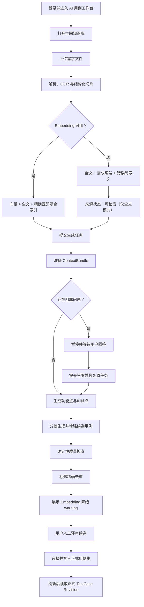

# CasePilot 用例生成用户动线：Embedding 降级

## 用户目标

用户上传需求资料，在 Embedding 服务不可用时仍能完成需求澄清、候选用例
评审和正式用例写入；系统明确提示检索与语义去重已降级，不静默隐藏风险。

## 端到端动线

## 降级时的用户可见反馈

| 环节 | 用户看到的状态 | 系统行为 |
| --- | --- | --- |
| 知识库索引 | 可检索 · 仅全文检索 | 保存无向量切片，不标记失败 |
| 上下文准备 | 正常进入下一阶段 | 使用全文、需求编号和错误码匹配 |
| 质量检查 | warning | 保留标题精确去重，跳过语义去重 |
| 候选评审 | 可继续选择和编辑 | 不自动写入正式资产 |
| 正式写入 | 用户点击后执行 | 创建正式用例及 Revision |

## 验收标准

1. Embedding Provider 明确禁用或返回错误时，知识来源仍进入 `ready`。
2. 知识库显示“仅全文检索（Embedding 不可用）”。
3. 生成任务完成 `context.prepared`，且 `retrieval_mode=lexical`。
4. 阻塞问题可以暂停、回答并恢复。
5. 至少生成一个功能点、测试点和候选用例。
6. 质量区域显示 Embedding 降级 warning。
7. 用户确认后候选写入正式集合。
8. 页面刷新后仍能读取正式用例和 Revision。
9. 登录后的浏览器控制台错误为 0。

## 实际验收结果

验收日期：2026-07-28
验收方式：Playwright + 生产 Web 构建 + FastAPI + Celery + PostgreSQL + Redis
测试配置：Mock Chat Provider，Embedding Provider 禁用，全文降级开启

| 边界 | 结果 | 证据 |
| --- | --- | --- |
| 登录与工作台 | 通过 | 登录接口 200，工作台正常渲染 |
| 上传知识来源 | 通过 | 上传接口 202 |
| 异步索引 | 通过 | Worker 返回 `status=ready`、`retrieval_mode=lexical` |
| 知识库状态恢复 | 通过 | 页面自动轮询并显示“仅全文检索” |
| 创建生成任务 | 通过 | 创建接口 202 |
| 阻塞澄清 | 通过 | 任务进入 `awaiting_input` |
| 回答并恢复 | 通过 | Answers 接口 202，原任务继续 |
| 候选与质量 warning | 通过 | 候选可见，Embedding 降级提醒可见 |
| 人工批量写入 | 通过 | Batch 接口 201 |
| 刷新读取 Revision | 通过 | 刷新后正式用例仍可读取 |
| 浏览器控制台 | 通过 | 登录后错误数 0 |

Playwright 最终结果：`1 passed`，业务场景耗时 9.3 秒。

验收中发现并修复：

1. 知识库上传后未轮询异步索引状态，导致新来源停留在旧状态。
2. E2E 从开发服务器切换为生产构建，避免开发调试遮罩干扰真实交互。

验收视频：

`artifacts/casepilot-embedding-fallback-acceptance-20260728.webm`
