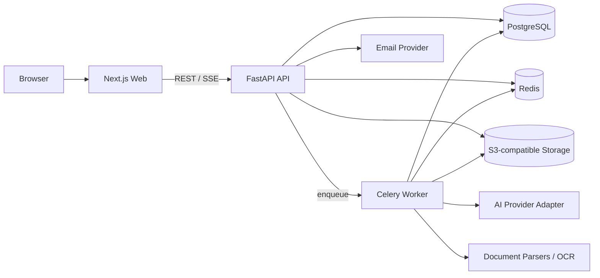

# CasePilot 开发基线 V1.2

> 日期：2026-07-27
> 状态：开发验收同步稿
> 适用范围：首个可公开发布的 MVP
> 冻结条件：第 17 节的待确认项全部形成决策记录

## 1. 基线结论

CasePilot 当前采用“可自部署的 Web + 模块化 API + 独立 Agent + PostgreSQL/Redis”架构；Agent 与 Mock Provider 已隔离到 `apps/agent`，当前产品界面和 OpenAPI 尚未启用生成任务入口。

- 保留当前原型的蓝白视觉、页面结构、React 组件、脑图交互和动效方向。
- 当前 `apps/web` 与 `apps/api` 已建立真实账号、空间、集合、用例、Revision、执行任务和审计模型。
- 文件、需求、风险、测试点、评审发布和文档模型按后续里程碑接入。
- Web、REST API 和 Worker 清晰分层，但第一版不拆分成大量微服务。
- AI 输出永远先形成候选工件，通过 Schema、规则和人工确认后才能成为权威用例版本。
- 用例集合与用例资产无 QA 执行状态；五种执行结果只属于具体 `ExecutionRecord`。
- 后续启用 AI 时，首页和集合工作台共用 `model_id`；每次 Generation Job 保存模型路由输入快照。
- 正常服务连接状态不作为业务导航常驻信息；仅在检查、降级和离线影响当前动作时显示。
- 不 fork 调研中的业务项目；以 clean-room 方式重新实现，仅使用许可证兼容的通用依赖。

建议评审结论：**有条件通过**。第 17 节中标记为“必须确认”的事项决定后即可冻结并开始 M0。

## 2. 产品目标

### 2.1 MVP 必须闭环

用户能够：

1. 进入或切换空间。
2. 在当前空间创建、选择和管理用例集合。
3. 通过对话输入目标并上传多种格式文件。
4. 查看文件解析、风险识别和 AI 生成进度。
5. 获取测试点脑图和结构化文本用例。
6. 在脑图或详情面板中对用例增删查改。
7. 对节点或分支发起自然语言 AI 改写，并评审差异。
8. 通过 Review Event 评审 Candidate Revision，并发布集合 Baseline。
9. 生成、编辑、发布并导出结构化测试说明。
10. 查看所有关键操作的版本和审计历史。
11. 加载一个用例集合，逐条执行并记录本次执行结果。

### 2.2 MVP 成功标准

- 使用一份真实 PRD 和一份真实历史 Excel，用 15 分钟以内得到第一版可评审用例集合。
- 每条用例至少包含名称、前置步骤、执行步骤和校验点。
- 用户能够定位 AI 结论的来源，识别 AI 推断和需求事实的区别。
- AI 改写不静默覆盖已发布 Revision。
- 页面刷新、模型超时或单文件失败不会清空已完成资产。
- 脑图、列表、详情和测试说明读取同一份结构化数据。

## 3. MVP 范围

### 3.1 纳入 V1

| 模块 | V1 能力 |
|---|---|
| 账号 | 自有邮箱验证码注册；首次云端保存、评审或共享时触发 |
| 空间 | 创建、切换、成员角色、资产隔离 |
| 用例集合 | 增删查改、搜索、修订信息、历史、Excel 导入 |
| 对话 | 多轮消息、附件、作用范围、快捷提示 |
| 文件中心 | DOCX、PDF、XLSX、XLS、CSV、Markdown、TXT、PNG、JPG |
| AI 分析 | 需求抽取、歧义、风险、业务规则、测试点和用例生成 |
| 生成任务 | 分阶段进度、取消、重试、断点恢复、检查点 |
| 脑图 | 查看、搜索、滑动平移、独立缩放、全屏、非叶子折叠、一键隐藏叶子、共同前置条件投影、增删改、移动、复制和批量操作 |
| AI 改写 | 单节点、子树、多选、字段级差异、接受/拒绝/撤销 |
| 版本 | 不可变 Revision、候选变更、集合 Baseline、审计 |
| 测试说明 | 章节编辑、追踪、覆盖率、Revision/Baseline、版本和导出 |
| 轻量测试执行 | 任务描述、冻结 Revision、执行队列、结果与进度 |
| 导出 | DOCX、PDF、Markdown、XLSX |

### 3.2 不纳入 V1

- 自动化脚本生成与代码仓库修改。
- 浏览器、接口或设备云执行。
- MCP Server 和本地 Coding Agent。
- Jira、禅道、GitHub Issues 等双向同步。
- 实时多人同时编辑同一节点。
- 企业 SSO、SCIM 和复杂组织层级。
- 移动端完整脑图编辑。
- 完整测试计划、复杂环境管理、设备矩阵和缺陷生命周期管理。

这些能力需要在 Schema 和 API 中预留扩展点，但不阻塞 V1 发布。

## 4. 生命周期与执行结果基线

### 4.1 资产生命周期

- TestCase 是稳定身份，内容保存在不可变 TestCaseRevision。
- Revision 生命周期使用 `draft | candidate | published | superseded`。
- 评审结论保存在 Review Event；通过或驳回不是 QA 执行结果。
- Collection 是复用容器，Collection Baseline 冻结一组精确 Revision。
- 资产页、脑图、详情和测试说明不得显示“最近一次执行结果”作为资产状态。

### 4.2 QA 执行结果

```text
execution_status:
  not_run
  passed
  failed
  skipped
  blocked
```

每个 ExecutionRun 必须包含 `space_id`、`collection_id`、`description`、创建人和时间。每个 ExecutionRecord 绑定 Run 与冻结的 `case_revision_id`，并保存最后更新成员和更新时间。空间成员可共同执行；更新必须携带 `base_updated_at`，发生并发冲突时返回 409，不得静默覆盖他人结果。新建执行任务不得复制或覆盖旧 Run 的结果。

## 5. 当前原型处理策略

### 5.1 可以保留

- 蓝白主题、排版和响应式布局。
- 单个用例集工作台的脑图、用例列表和测试说明三种视图。
- 全局对话首页、空间级用例集管理页和单集合工作台的三级信息架构。
- 对话框、附件、脑图、集合、用例详情和测试说明组件的视觉实现。
- React Flow 脑图技术验证。
- Motion 动画参数和交互节奏。
- shadcn/Radix 基础组件组合。
- 已完成的 Figma V1.1 页面和设计变量。

### 5.2 需要重构

- 单个大型客户端组件拆分为路由、领域模块和状态边界。
- 当前前端页面状态进一步迁移为 `/spaces/:spaceId`、`/collections` 和 `/collections/:collectionId` 正式路由。
- Mock data 改为类型化 API 客户端和服务端数据。
- 浏览器内模拟生成改为持久化异步任务。
- 临时 `useState` 空间和身份改为服务端权威数据。
- 当前上传格式、数量和大小限制与产品基线对齐。
- 移除资产页和脑图上的执行结果状态；结果只在 QA 执行与历史页面展示。
- 错误、空状态、权限和并发冲突补齐。

### 5.3 不进入正式工程

- 原型托管平台专用身份头。
- 空的 D1/Drizzle Schema。
- 只为演示准备的固定 ID、固定消息和计时器。
- 调研项目的业务代码、视觉资产或 Prompt 原文。

## 6. 系统架构



架构原则：

- Web 负责渲染、交互、本地编辑状态和乐观反馈，不保存权威业务状态。
- API 是唯一写入入口，负责权限、验证、事务、版本、状态和审计。
- Worker 负责文件解析、OCR、AI 生成、质量检查和文档导出。
- PostgreSQL 保存结构化权威数据。
- 对象存储保存原始附件、解析中间件、导出文件和证据。
- Redis 用于任务 Broker、短期缓存、进度广播和限流，不作为权威数据库。
- 生成进度通过 SSE 单向推送；V1 不为此引入 WebSocket。

## 7. 技术栈基线

### 7.1 Web

| 项目 | 基线 |
|---|---|
| Runtime | Node.js 24 LTS |
| Framework | Next.js 16.x App Router |
| Language | TypeScript strict |
| UI | React、Tailwind CSS、shadcn/Radix |
| 脑图 | React Flow 12.x |
| 动画 | Motion |
| API 客户端 | 根据 OpenAPI 生成，禁止手写重复 DTO |
| 表单与校验 | 前端 Schema 与 OpenAPI 类型协作 |
| 测试 | Vitest、Testing Library、Playwright |

### 7.2 API 与 Worker

| 项目 | 基线 |
|---|---|
| Runtime | Python 3.13.x |
| API | FastAPI |
| Schema | Pydantic v2 / JSON Schema |
| ORM | SQLAlchemy 2 |
| Migration | Alembic |
| Worker | Celery 5.6 |
| 测试 | pytest、pytest-asyncio |
| 包管理 | uv，提交锁文件 |

选择 Python 服务层的原因是文件解析、OCR、AI Schema 和质量评估生态更适合当前产品；Web 仍保留现有 TypeScript 资产。FastAPI 以 OpenAPI 和 JSON Schema 为基础，适合生成跨语言客户端；Celery 用于可重试的长任务。

### 7.3 基础设施

| 能力 | 基线 |
|---|---|
| 数据库 | PostgreSQL 18；Schema 不依赖专有扩展 |
| 队列/缓存 | Redis |
| 文件 | S3-compatible API；本地开发使用经过许可证评审的兼容实现 |
| 邮件开发 | 本地邮件捕获服务；生产注入邮件 Provider |
| 可观测性 | OpenTelemetry traces/metrics/log correlation |
| 本地环境 | Docker Compose |
| 生产封装 | OCI 容器；不把 Kubernetes 作为 V1 必需条件 |

依赖版本在创建正式工程时锁定，后续通过自动依赖更新 PR 升级，不使用无上限的浮动版本。

## 8. 仓库结构

```text
AICaseGen/
├── apps/
│   ├── web/                 # Next.js
│   ├── api/                 # FastAPI
│   └── worker/              # Celery tasks
├── packages/
│   ├── design-system/       # Web 设计系统
│   ├── api-client/          # OpenAPI 生成客户端
│   ├── schemas/             # JSON Schema 和生成产物
│   └── config/              # lint、format、tsconfig
├── infra/
│   ├── compose/
│   └── containers/
├── migrations/
├── tests/
│   ├── contract/
│   ├── e2e/
│   ├── fixtures/
│   └── ai-evals/
├── docs/
├── prototype/               # 只读参考，迁移完成后归档
├── LICENSE
├── CONTRIBUTING.md
└── SECURITY.md
```

前后端使用一份 OpenAPI 契约。Python 生成 OpenAPI，CI 生成 TypeScript Client；客户端产物发生未提交变化时 CI 失败。

## 9. 核心数据模型

### 9.1 账号与空间

- `accounts`
- `email_verification_codes`
- `sessions`
- `spaces`
- `space_memberships`
- `space_invitations`

角色基线：Owner、Editor、Reviewer、Viewer。

### 9.2 集合与来源

- `case_collections`
- `collection_case_memberships`
- `source_files`
- `source_file_versions`
- `source_fragments`
- `import_batches`
- `import_rows`

原文件不可被新上传静默覆盖；同一来源形成新版本。

### 9.3 AI 会话与任务

- `design_sessions`
- `chat_messages`
- `message_attachments`
- `generation_jobs`
- `generation_job_stages`
- `generation_artifacts`
- `prompt_versions`

`generation_jobs` 至少记录：

- provider、model、prompt version、schema version
- 输入来源版本与 input hash
- 状态、阶段、重试次数、检查点
- token/耗时/费用元数据
- 错误类型和可重试性

### 9.4 需求、风险、测试点和用例

- `requirements`
- `requirement_revisions`
- `risks`
- `test_points`
- `test_cases`
- `test_case_revisions`
- `test_case_steps`
- `review_events`
- `comments`
- `traceability_links`

约束：

- TestCase 是稳定身份；TestCaseRevision 是不可变内容。
- 步骤固定在 Revision 下，不直接挂在可变 TestCase 上。
- 追踪关系尽量连接精确 Revision。
- Review Event 关联精确 Revision、操作者、时间和结论。
- 脑图父子关系使用稳定 ID；拖拽改变结构，不自动改变需求追踪。
- 滚轮或触控板双指滑动只更新视口 `x/y`，不得修改 `zoom`；捏合手势和显式工具栏操作可以修改 `zoom`。
- 所有非叶子节点必须支持隐藏/显示其叶子，脑图工具栏必须支持一键隐藏/显示全部叶子；折叠状态属于会话级视图偏好。
- 同一模块内完全相同且至少被两条叶子用例引用的前置条件可投影为共同前置条件节点。每条叶子最多选择一个复用次数最高的共同条件作为视觉父节点，Revision 原始数据保持不变。
- 自动布局至少为“集合、模块、共同前置条件、叶子用例”预留四列，并保证节点间连接线具有可辨识长度。
- 画布右上角必须提供全屏入口；进入后自动适配节点，`Esc` 或退出按钮恢复原布局，原生全屏不可用时降级为页面内全屏。

### 9.5 文档与审计

- `test_documents`
- `test_document_revisions`
- `export_jobs`
- `audit_events`
- `outbox_events`

审计事件追加写入，不提供普通业务 API 删除。

## 10. REST API 基线

统一前缀：`/api/v1`。所有资源 ID 使用不可推测的稳定 ID。

### 10.1 空间与集合

```text
GET    /spaces
POST   /spaces
GET    /spaces/{space_id}
PATCH  /spaces/{space_id}

GET    /spaces/{space_id}/collections
POST   /spaces/{space_id}/collections
GET    /collections/{collection_id}
PATCH  /collections/{collection_id}
DELETE /collections/{collection_id}
```

### 10.2 文件与导入

```text
POST   /spaces/{space_id}/files/uploads
POST   /files/{file_id}/complete
GET    /files/{file_id}
POST   /collections/{collection_id}/imports
GET    /imports/{import_id}
POST   /imports/{import_id}/confirm
POST   /imports/{import_id}/rollback
```

大文件通过预签名 URL 上传，不经过 Web Server 中转。

### 10.3 会话、风险与生成

```text
POST   /spaces/{space_id}/design-sessions
POST   /design-sessions/{session_id}/messages
POST   /design-sessions/{session_id}/generation-jobs
GET    /generation-jobs/{job_id}
GET    /generation-jobs/{job_id}/events
POST   /generation-jobs/{job_id}/cancel
POST   /generation-jobs/{job_id}/retry
GET    /design-sessions/{session_id}/risks
PATCH  /risks/{risk_id}
```

`events` 使用 SSE，事件包含 `sequence`，客户端断线后用 `Last-Event-ID` 恢复。

### 10.4 脑图与用例

```text
GET    /collections/{collection_id}/tree
POST   /test-points
PATCH  /test-points/{test_point_id}
DELETE /test-points/{test_point_id}

GET    /collections/{collection_id}/test-cases
POST   /collections/{collection_id}/test-cases
GET    /test-cases/{case_id}
POST   /test-cases/{case_id}/revisions
POST   /test-cases/{case_id}/candidate-revisions
POST   /candidate-revisions/{candidate_id}/apply
```

更新 Revision 时携带 `base_revision_id`；基线已变化返回 `409 Conflict` 和可合并差异。用例是可跨版本复用的资产，不保存通过、不通过、跳过或堵塞状态。

### 10.5 测试说明

```text
GET    /collections/{collection_id}/test-document
POST   /collections/{collection_id}/test-document/generate
POST   /test-documents/{document_id}/revisions
POST   /test-documents/{document_id}/exports
GET    /exports/{export_id}
```

### 10.6 API 通用规则

- 创建和重试接口支持 `Idempotency-Key`。
- 写操作必须校验空间成员和对象所属空间。
- 列表使用游标分页。
- Web 用例列表交互固定为每页 20 条；搜索、集合切换时重置第一页，结果数量变化时派生有效页码，避免通过 Effect 同步本地分页状态。
- Patch 只修改传入字段。
- 错误采用统一 `problem+json` 结构，包含机器码、用户文案和 trace ID。
- 所有批量写操作先返回影响摘要，确认后执行。

## 11. AI 与文件处理管线

### 11.1 文件处理

```text
上传完成
→ MIME/扩展名/大小校验
→ 安全扫描
→ 格式路由
→ 文本/表格/OCR 提取
→ 章节和单元格切分
→ 来源定位
→ 规范化片段
→ 可检索上下文
```

初始限制建议：

- 单次消息最多 10 个文件。
- 单文件最多 50 MB。
- 单个生成任务原始文件总量最多 500 MB。
- Excel 默认预览前 100 行，后台可以继续校验全部数据。
- OCR 作为可配置能力；没有 OCR 时明确提示，不伪装为解析成功。

限制作为空间配置保存，服务端始终执行，不只依赖前端。

### 11.2 生成阶段

1. Context Normalize：形成带来源的需求快照。
2. Extract：抽取显式需求、角色、实体和规则。
3. Analyze：识别风险、歧义、不变量和边界。
4. Confirm：高风险和低置信度推断等待人工确认。
5. Map：生成需求—测试点覆盖关系。
6. Generate：生成结构化用例候选。
7. Validate：执行 Schema、引用、重复、步骤和校验点检查。
8. Persist Candidate：创建 TestCase 和不可变 Candidate Revision。
9. Document Candidate：按同一数据生成测试说明候选稿。

每个阶段都保存输入引用、输出 artifact、Schema 版本和检查点。

### 11.3 AI 输出约束

- 输出必须通过服务端 Pydantic/JSON Schema 校验。
- 模型生成的 ID 不作为数据库主键。
- 每个推断项带 `evidence_type`：requirement、history、user、inference。
- 每个用例至少包含 title、preconditions、steps、expected_results。
- AI 不能直接发布 Revision 或写入 QA 执行结果；输出固定为 Candidate Revision。
- AI 改写输出 Patch 和理由，不输出“已经修改成功”的假状态。
- Provider 不可用时不清空输入、检查点和已生成 artifact。

## 12. 账号、权限与安全

### 12.1 注册体验

- 不设置首次访问登录墙。
- 未注册用户可以查看产品和制作本地临时草稿。
- 首次云端保存、创建空间、提交状态或共享时触发注册。
- 注册方式为邮箱验证码；成功后恢复触发注册前的操作。
- 服务端使用安全、HttpOnly、SameSite Cookie 会话。

### 12.2 空间隔离

- 所有领域表直接或间接关联 `space_id`。
- API 在读取对象后仍验证对象所属空间，不信任客户端传入的空间 ID。
- 权限测试覆盖“已知其他空间 ID”的越权访问。
- Worker 消息只携带内部 ID，执行前重新校验任务和空间状态。

### 12.3 文件和 AI 安全

- 文件名不作为存储路径。
- 使用服务端 MIME sniffing，限制压缩炸弹、宏和超时。
- Office/PDF 转换进程使用资源限制和隔离容器。
- 上传文件视为不可信数据，其中的 Prompt 指令不能改变系统权限。
- 对象下载使用短期签名 URL。
- Provider 凭据不进入浏览器、日志和导出文件。
- 日志默认脱敏邮箱、验证码、Token、附件正文和模型密钥。

### 12.4 审计

以下行为必须写审计：

- 空间成员和权限变化。
- 文件上传、删除、导入和回滚。
- AI 生成、重试、取消和模型切换。
- 用例新增、修订、软删除、恢复和 Review Event。
- 候选改写接受或拒绝。
- 文档发布和导出。

## 13. 质量基线

### 13.1 测试分层

| 层级 | 覆盖 |
|---|---|
| 单元测试 | 状态机、权限、Schema、解析器、diff、去重规则 |
| API 集成 | PostgreSQL、Redis、对象存储、幂等、事务、冲突 |
| 契约测试 | OpenAPI、生成客户端、SSE 事件 |
| 组件测试 | 聊天框、上传队列、执行结果选择、差异视图、脑图平移/缩放/全屏、分支折叠、共同前置条件投影、工具栏一键隐藏和任务描述必填反馈 |
| E2E | 真实浏览器跑通核心闭环和异常分支 |
| AI Evals | 结构合法率、来源正确率、覆盖率、重复率、人工接受率 |
| 迁移测试 | 空库升级、旧版本升级、回滚安全性 |

### 13.2 CI 必须通过

```text
format
lint
typecheck
unit tests
API integration tests
OpenAPI client freshness
database migration check
web build
container build
license / dependency scan
critical E2E smoke
```

### 13.3 非功能验收

- 常规 CRUD API P95 小于 500 ms，不包含 AI 和文件处理。
- 生成状态变化在 2 秒内推送到前台。
- 10,000 条用例集合采用分页/虚拟化，不一次加载全部详情。
- 用例列表验证 0、1、20、21 条及删除最后一页唯一记录等分页边界；标题摘要换行时不得与工具栏或分隔线重叠。
- 1,000 个可见脑图节点完成性能专项验证；默认通过折叠限制可见节点。
- 大脑图隐藏/显示全部叶子后，缩放比例保持不变，布局重算不产生节点重叠或错误父子连线。
- 任务描述为空时创建按钮仍可操作，并在点击后提供字段级提示与自动聚焦；不得以无反馈禁用状态阻断用户。
- 桌面端满足键盘访问和 WCAG AA 对比度。
- 所有网络操作具有 loading、empty、error、retry 和 unauthorized 状态。

## 14. 可观测性与运维

- HTTP 请求、任务、模型调用和导出使用同一 trace ID。
- 指标至少包含 API 延迟、错误率、队列等待、任务耗时、阶段失败、Schema 失败、Token/成本和人工接受率。
- 生成任务日志使用结构化字段，不记录完整附件正文。
- Worker 任务设定最大重试、指数退避、超时和死信处理。
- 数据库迁移在应用启动前独立执行，应用进程不自动修改生产 Schema。
- 每日备份 PostgreSQL；对象存储启用版本或保留策略。

## 15. 开源与许可证基线

- 主仓库建议采用 Apache-2.0。
- 不 fork Kiwi TCMS、BrowserStack MCP 或其他调研业务项目。
- 只参考公开产品行为、状态机和抽象模型，独立实现代码、Prompt、Schema 和 UI。
- 引入依赖前确认许可证、维护状态和替代方案。
- CI 生成第三方许可证清单和 SBOM。
- `NOTICE` 记录需要归属声明的依赖或资产。
- Logo、项目名、截图和示例数据必须自有或明确授权。
- 安全问题通过 `SECURITY.md` 的私密渠道报告。

## 16. 里程碑与退出标准

### M0：工程骨架

- 建立正式目录、容器、本地 Compose、CI、代码规范和 OpenAPI 生成链。
- Web、API、Worker、PostgreSQL、Redis、对象存储可以一键启动。
- 退出标准：空业务环境的 build、test、migration、health check 全部通过。

### M1：账号、空间、集合

- 完成延迟注册、邮箱验证码、空间权限、集合 CRUD 和审计。
- 迁移原型的全局布局、空间选择和集合页面。
- 退出标准：两个空间之间的读写隔离 E2E 通过。

### M2：文件与 Excel

- 完成上传、对象存储、解析任务、来源片段、Excel 映射、预览、导入和回滚。
- 退出标准：真实样本集解析与失败恢复通过，单文件失败不阻塞批次。

### M3：AI 分析与生成

- 完成 Provider Adapter、生成阶段、SSE、风险、测试点、用例 Schema 和质量门。
- 退出标准：真实 PRD 从上传到 Candidate Revision 闭环，刷新后任务可恢复。

### M4：脑图、编辑与版本

- 完成脑图 CRUD、详情编辑、候选改写、diff、并发冲突、状态机和审计。
- 退出标准：已发布用例被修改时生成新的 Candidate Revision，旧 Published Revision 保持不可变。

### M5：测试说明与发布

- 完成测试说明、章节同步、覆盖率、Revision/Baseline、版本和四种导出。
- 退出标准：发布文档可追踪到精确用例 Revision 和来源。

### M6：发布准备

- 完成性能、权限、安全、备份恢复、许可证、安装文档和贡献指南。
- 退出标准：全新机器按 README 自部署并跑通核心 E2E。

具体日历排期在确认参与人数、投入比例和 AI Provider 后制定，开发基线不虚构工期。

## 17. 待评审决策

| ID | 决策 | 推荐值 | 状态 |
|---|---|---|---|
| D-01 | V1 是否按第 3 节范围冻结 | 是 | 必须确认 |
| D-02 | QA 结果是否只属于 Execution Record | 是 | 已接受 |
| D-03 | Revision 是否使用独立生命周期并由 Review Event 评审 | 是 | 已接受 |
| D-04 | 一条用例是否可以属于多个集合 | 可以 | 必须确认 |
| D-05 | 当前自部署验收是否使用本地账号登录 | 是；公开演示版另行决策 | 已接受 |
| D-06 | 首个默认 AI Provider | Provider Adapter，默认值由部署者配置 | 必须确认 |
| D-07 | OCR 是否作为 V1 默认能力 | 接口纳入，默认可选安装 | 必须确认 |
| D-08 | 主仓库许可证 | Apache-2.0 | 必须确认 |
| D-09 | 首个正式部署目标 | Docker Compose 自部署 | 必须确认 |
| D-10 | 文件初始限制 | 10 个/消息、50 MB/文件、500 MB/任务 | 可调整 |
| D-11 | 首发导出格式 | DOCX、PDF、Markdown、XLSX | 可调整 |
| D-12 | 删除保留期 | 软删除 30 天 | 可调整 |
| D-13 | 默认空间角色 | Owner、Editor、Reviewer、Viewer | 可调整 |
| D-14 | 测试说明是否允许锁定人工确认章节 | 允许 | 建议通过 |
| D-15 | MCP 和自动化是否明确延后到 V1 后 | 是 | 必须确认 |
| D-16 | 首页和集合工作台是否共享模型选择 | 是；任务保存 `model_id` 快照 | 已接受 |
| D-17 | 是否移除常驻“本地服务已连接” | 是；异常时再提示 | 已接受 |

## 18. 基线冻结规则

完成以下动作后，文档状态由“待评审”改为“已冻结”：

1. D-01 至 D-09、D-15 得到明确结论。
2. 每个不同意项有替代决策和影响说明。
3. 产品规格、Figma、数据库状态模型和 API 命名保持一致。
4. 创建 ADR：架构、状态模型、身份、AI Provider、存储和许可证。
5. 创建正式工程分支并完成 M0 骨架。

冻结后，MVP 范围和核心数据对象的变更需要新增 ADR，不能仅在实现中隐式改变。

## 19. 技术资料

- [Next.js App Router](https://nextjs.org/docs/app)
- [Next.js 自部署与生产指南](https://nextjs.org/docs/app/guides)
- [FastAPI](https://fastapi.tiangolo.com/)
- [React Flow](https://reactflow.dev/)
- [Celery](https://docs.celeryq.dev/en/stable/getting-started/introduction.html)
- [PostgreSQL](https://www.postgresql.org/docs/current/index.html)
- [OpenTelemetry](https://opentelemetry.io/docs/)
- [Node.js Releases](https://nodejs.org/en/about/previous-releases)
- [Python Releases](https://www.python.org/downloads/)
