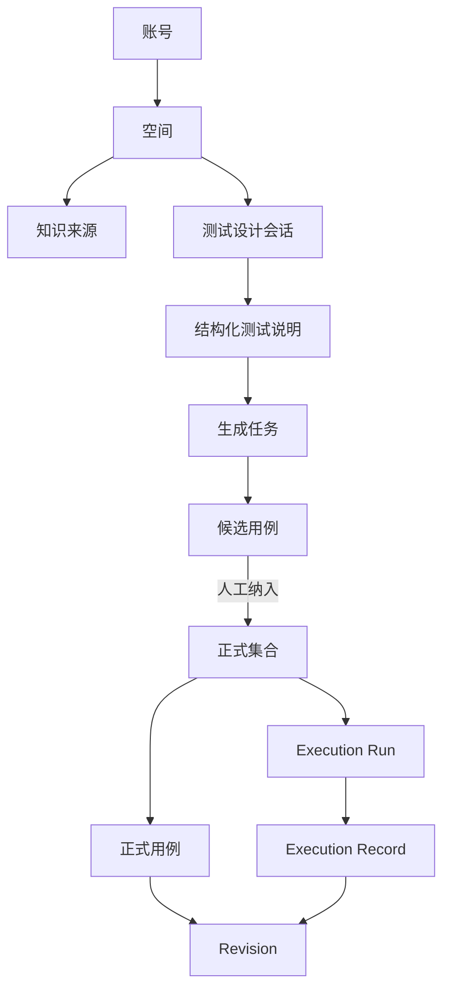

# CasePilot 产品设计 V1.0

> 版本：V1.0
> 更新时间：2026-07-30
> 状态：已按当前实现与端到端测试重建
> Figma：[V1.0 端到端设计](https://www.figma.com/design/fRnEKJHcshgCIa1CmYXbLx?node-id=165-38) · [V1.0 组件](https://www.figma.com/design/fRnEKJHcshgCIa1CmYXbLx?node-id=165-30)

## 1. 产品定义

CasePilot 把需求材料和自然语言目标转换为可评审的结构化测试说明与候选用例，
经人工确认后进入正式用例资产，并在独立 QA 执行任务中记录结果。

产品不是“输入一句话直接写入用例库”的生成器。V1.0 的价值是把四个容易混淆的
阶段分开：

1. 需求理解；
2. 测试设计；
3. 正式资产；
4. QA 执行。

## 2. 目标用户

- 测试工程师：从需求快速得到可执行的用例初稿并人工收口。
- 测试负责人：检查范围、风险、来源与正式资产质量。
- 产品经理：回答需求歧义，确认成功标准。
- 开发工程师：查看测试依据、步骤和验收结果。

## 3. V1.0 成功标准

- 新用户登录后无需先创建集合即可开始第一条测试设计对话。
- 信息不足时，系统明确阻塞问题，不生成看似完整但依据不足的用例。
- 用户能在测试说明确认前理解测试对象、范围、成功标准和来源。
- 候选用例不会在用户不知情时进入正式资产。
- 正式用例刷新可恢复，修改形成 Revision。
- QA 结果能追溯到 Execution Run 和冻结的 Revision。
- Figma、README、交互规格与自动化测试描述同一条链路。

## 4. 信息架构

对象边界：

- Space 是成员与资产可见性的最高边界。
- Conversation 保存消息、测试说明版本和生成上下文。
- Candidate 可以修改或丢弃，不是正式资产。
- Collection 组织正式用例，不承载 QA 结果。
- Revision 是用例内容版本。
- Execution Run 冻结 Revision；Execution Record 保存本次结果。

## 5. 一级页面

### 5.1 新对话

默认入口只保留完成第一步所需的信息：目标、模型和发送。集合在后台自动创建，
降低新用户首次成本。

设计原则：

- 一个中心任务；
- 一个主操作；
- 示例只辅助表达，不替代输入；
- 历史记录可发现但不抢占主视觉。

Figma：[New Conversation](https://www.figma.com/design/fRnEKJHcshgCIa1CmYXbLx?node-id=165-43)

### 5.2 空间知识库

知识库回答两个问题：材料是否可检索，以及生成引用了什么。文件格式、索引方式
和降级状态必须明确，但底层向量实现不占据主要界面。

Figma：[Knowledge Ready](https://www.figma.com/design/fRnEKJHcshgCIa1CmYXbLx?node-id=165-44)

### 5.3 测试说明

测试说明是人机共同确认的中间产物。三栏分别承担：

- 左栏：对话澄清；
- 中栏：结构化测试说明；
- 右栏：来源和约束。

阻塞问题与已解决状态同时可见，帮助用户理解为什么之前不能生成、现在为什么可以。

Figma：[Structured Brief](https://www.figma.com/design/fRnEKJHcshgCIa1CmYXbLx?node-id=165-45)

### 5.4 候选评审

候选评审优先支持高密度浏览和结构化检查。列表负责定位，中栏负责可执行性，
右栏负责覆盖概览。“纳入正式集合”是页面唯一高强调动作。

Figma：[Candidate Review](https://www.figma.com/design/fRnEKJHcshgCIa1CmYXbLx?node-id=165-46)

### 5.5 正式用例管理

正式资产使用“集合 / 用例 / 详情”三栏。页面强调搜索、Revision、来源和启动执行，
不展示与资产无关的“最近一次通过/失败”。

Figma：[Formal Case Library](https://www.figma.com/design/fRnEKJHcshgCIa1CmYXbLx?node-id=165-47)

### 5.6 历史记录

历史记录使用覆盖式抽屉，保持用户对当前页面的空间记忆。会话摘要使用业务阶段，
而不是内部任务状态码。

Figma：[Conversation History](https://www.figma.com/design/fRnEKJHcshgCIa1CmYXbLx?node-id=165-48)

### 5.7 QA 执行

执行页将队列、当前步骤和审计概览并列。结果操作靠近当前用例，证据和实际结果
属于本次 Run；历史日志保持只读。

Figma：[QA Execution](https://www.figma.com/design/fRnEKJHcshgCIa1CmYXbLx?node-id=165-49)

## 6. 视觉系统

V1.0 复用原文件中已有的 58 个变量、9 个文字样式和 3 个阴影样式，不另建
平行主题。

### 6.1 颜色

- `surface/*`：页面、面板和弱强调背景。
- `text/*`：主要、次要、弱化与反色文字。
- `border/*`：默认边框和选中边框。
- `action/*`：主操作与交互强调。
- `state/*`：成功、警告和危险。

状态同时使用色点与文字，不用颜色作为唯一编码。

### 6.2 字体

- 中文界面：Noto Sans SC，作为浏览器系统中文字体的 Figma 等价表达。
- 拉丁标题与数字：Geist。
- 编号、时间、版本与指标：Geist Mono。

### 6.3 布局

- 设计基准：1440 × 900。
- 顶栏：68px。
- 主内容安全边距：24px。
- 面板圆角：12px；主输入卡片：16px。
- 高密度三栏只在需要比较上下文、对象和详情时使用。

## 7. V1.0 组件

Figma：[Components V1.0](https://www.figma.com/design/fRnEKJHcshgCIa1CmYXbLx?node-id=165-30)

| 组件 | 变体 | 使用位置 |
| --- | --- | --- |
| Nav Item | Active=True/False | 一级导航 |
| Action Button | Primary/Secondary × Default/Disabled | 确认、交接、执行 |
| Status Pill | Neutral/Success/Warning/Danger | 索引、生成、资产、执行 |
| List Row | Selected=True/False | 候选、正式用例、集合 |

所有组件绑定现有颜色、间距和圆角变量，并暴露必要的文字属性。V1.0 不引入与
产品风格不一致的外部组件库。

## 8. 内容与术语

统一使用：

- “空间知识库”，不用“知识库”作为导航名；
- “AI 用例工作台”；
- “结构化测试说明”；
- “候选用例”；
- “纳入正式集合”，不用“写入用例集”；
- “正式资产”；
- “执行用例”与“Execution Run”。

禁止用“发布成功”描述候选转正式，也禁止用“通过/失败”描述正式用例本身。

## 9. 可访问性与反馈

- 状态标签必须包含文字。
- 主要正文与背景保持可读对比度。
- 键盘可聚焦输入、按钮、列表行和抽屉关闭动作。
- 禁用操作同时说明阻塞原因。
- 错误提示靠近受影响字段或任务，不在页面顶部长期占位。
- 动画只解释布局或状态变化，并尊重减少动态效果设置。

## 10. V1.0 范围外

- 自动化脚本生成与执行；
- 外部项目管理/文档连接器；
- AI 自动发布正式用例；
- 多人实时共同编辑；
- 缺陷系统双向同步；
- 将单次执行结果聚合成资产状态。
