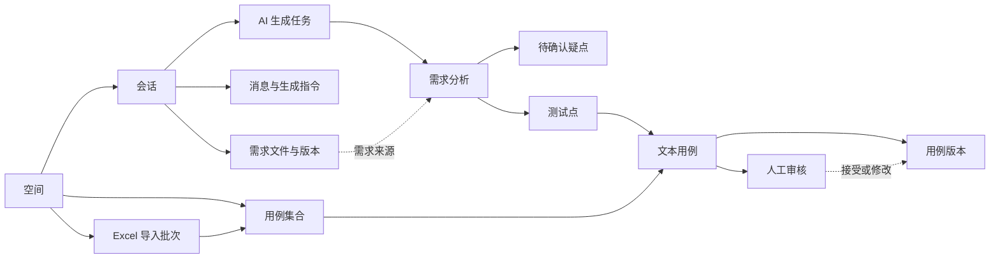
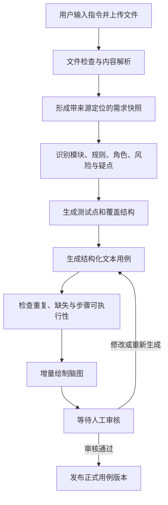
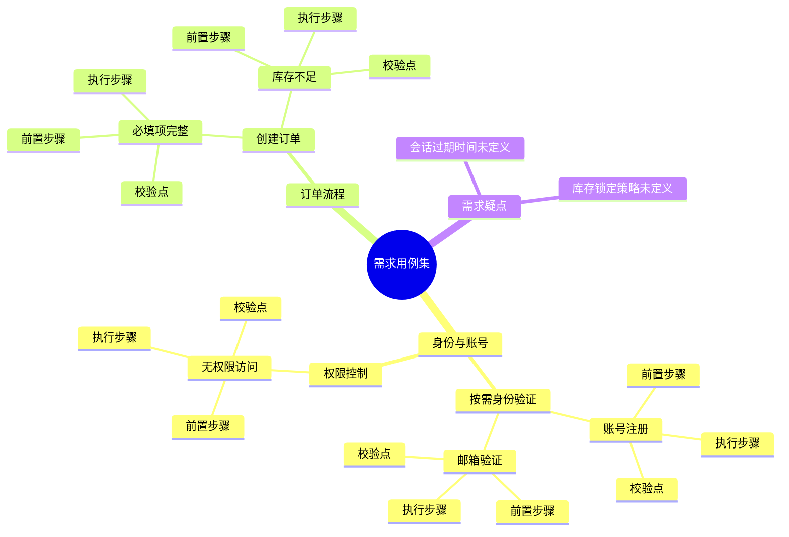

# AI 驱动的用例生成平台：产品设计 V1.5

> 文档状态：开发验收同步稿
> 版本：V1.6
> 更新时间：2026-07-27
> 目标：定义可原型、可验证、可进入工程设计的产品体验，并与当前 `apps/web`、Figma 和交互规格保持一致。
> Figma：[脑图全屏 V4](https://www.figma.com/design/fRnEKJHcshgCIa1CmYXbLx?node-id=110-25) · [执行任务历史 V4](https://www.figma.com/design/fRnEKJHcshgCIa1CmYXbLx?node-id=102-2) · [多人执行详情 V4](https://www.figma.com/design/fRnEKJHcshgCIa1CmYXbLx?node-id=77-3) · [任务必填校验 V4](https://www.figma.com/design/fRnEKJHcshgCIa1CmYXbLx?node-id=111-25)

## 0. V1.6 变更摘要

- AI 用例工作台已进入开发基线：主导航默认入口为聊天创建页，发送后展开
  “对话 / 脑图或列表 / 用例详情”三栏工作区。
- 首次创建页明确选择目标用例集合，并提示候选内容只有人工确认后才写入
  正式资产。
- 三栏工作区新增阶段进度、覆盖提醒、AI 候选标识、批量写入和新建对话。
- 当前工程以本地候选生成验证交互闭环；真实 Provider、文档解析、可恢复
  Generation Job 和字段级改写 Diff 仍按后续里程碑实现。

- 首页与用例集工作台共用同一模型选择：自动选择、Test Design Pro、本地模型。
- 模型选择写入生成任务输入快照；切换页面或进入集合工作台不会丢失。
- 用例集合和用例资产不承载 QA 执行状态；执行结果只属于具体执行任务。
- 工作区不再持续展示“本地服务已连接”；服务健康信息进入设置或故障提示，仅在异常时打扰用户。
- 脑图缩放、对话发送和详情提交评审保留底部安全间距。
- 发送按钮统一为低对比度深灰圆形按钮和向上箭头，首页与集合工作台行为一致。
- 当前自部署验收采用本地账号登录；公开版是否改为无登录墙仍作为后续产品决策，不与当前验收流程混写。
- QA 执行页只要求填写任务描述，每次创建独立 Run 并冻结用例 Revision。
- QA 执行入口首先展示空间级任务历史、实时进度、结果分布和参与成员；单任务执行为二级页面。
- 同空间成员可共同执行，更新采用乐观并发控制，避免覆盖他人的最新结果。
- 脑图提供显式全屏入口，复杂用例树可占满视口查看；退出后恢复原列表布局。
- 执行任务描述为空时采用字段级错误提示和自动聚焦，不允许按钮以无反馈禁用状态阻断操作。
- 评审结论使用 Review Event，发布状态使用 Revision/Baseline 生命周期，均不复用执行结果。

## 1. 产品定义

这是一个以自然语言对话为入口、以需求文档为上下文、以脑图为主要组织方式的 AI 测试用例生成与评审平台。

用户可以上传 Word、PDF、Markdown、纯文本等需求文件，补充一句自然语言指令，然后发送。平台自动解析材料、识别需求模块与风险、生成测试点和结构化文本用例，并将结果组织为可展开、可编辑、可追踪的脑图。AI 只生成 Candidate Revision，用户接受并完成评审后才形成 Published Revision。

### 1.1 核心价值

- 降低从需求文档到测试用例初稿的时间。
- 把 AI 的分析依据、覆盖思路和生成结果可视化，而不是只返回一段文本。
- 支持人通过对话持续修改局部脑图，而不必重新生成全部用例。
- 保留需求、测试点、用例和人工审核之间的追踪关系。

### 1.2 V1 成功标准

- 用户能在 3 分钟内完成“上传需求 → 生成脑图 → 打开用例 → 修改并确认”的首次闭环。
- 每个测试用例至少包含用例名称、前置步骤、执行步骤、校验点。
- 用户能看懂 AI 当前在分析什么、生成到哪一步，以及结果来源于哪段需求。
- 用户可以只重新生成某个模块、测试点或用例，不覆盖已经确认的其他内容。
- 所有 AI 生成内容先形成 Candidate Revision；人工接受、评审与发布分别保存为 Revision/Baseline 和 Review Event，不复用 QA 执行结果。

### 1.3 V1 暂不包含

- 自动执行浏览器或接口测试。
- 完整的测试计划、测试环境和缺陷管理。
- Jira、禅道、GitHub Issues 等双向同步。
- 多人同时编辑同一张脑图。
- AI 自动发布正式用例。

## 2. 目标用户与核心任务

### 2.1 目标用户

- 测试工程师：从需求快速形成覆盖充分的用例初稿。
- 测试负责人：审核覆盖范围、风险优先级与用例质量。
- 产品经理：补充需求歧义，查看需求是否被测试覆盖。
- 开发工程师：理解验收标准与关键异常场景。

### 2.2 核心任务

1. 输入需求背景或上传需求文档。
2. 指定生成范围、测试类型或额外约束。
3. 查看 AI 分析过程、需求疑点与生成进度。
4. 在脑图中检查需求模块、测试点和用例覆盖。
5. 打开用例详情，修改步骤与校验点。
6. 通过自然语言要求 AI 补充、精简或重新生成选中分支。
7. 审核并发布一个正式用例版本。

## 3. 产品信息架构



### 3.1 一级导航

- 空间：空间切换、成员、用例集合、需求、导入记录和空间设置。
- 工作台：当前会话、需求文件、生成结果、Revision/Baseline 和评审事件。
- 用例集合：空间内集合的查看、新建、搜索、修改、删除和 Excel 导入。
- 用例库：空间内已发布的正式用例版本。
- 测试执行：加载集合 Baseline、逐条执行、记录本次结果和进度。
- 生成记录：历史任务、模型、输入版本、耗时与错误。
- 空间设置：成员、模型提供商、数据保留和导出设置。

V1 的绝大部分时间应停留在“工作台”，避免用户在多个页面之间来回跳转。

## 4. 工作台布局

### 4.1 桌面端

```text
┌──────────────────────────────────────────────────────────────────────────────┐
│ 空间 / 会话名称     脑图｜用例集合｜用例列表｜需求分析   覆盖概览  审核并发布 │
├──────────────────┬───────────────────────────────────┬───────────────────────┤
│ 会话与资料        │                                   │ 选中节点详情           │
│                  │                                   │                       │
│ 对话摘要          │           脑图主画布               │ 用例名称               │
│ 历史消息          │                                   │ 前置步骤               │
│                  │    模块 → 测试点 → 测试用例        │ 执行步骤 / 校验点       │
│ 已上传文件        │                                   │ 来源、修订与评审历史      │
│ 文档版本          │                                   │                       │
├──────────────────┴───────────────────────────────────┴───────────────────────┤
│ ＋添加文件   向 AI 说明要测试什么，或要求修改选中的分支……        [发送]   │
└──────────────────────────────────────────────────────────────────────────────┘
```

布局规则：

- 左栏约 280px，用于保留对话上下文和需求材料。
- 中间为可缩放、可平移的脑图主画布。
- 右栏约 400px，仅在选中节点时显示详情和审核操作。
- 底部聊天框始终可用；如果用户选中了脑图节点，新消息默认作用于该节点。
- 右栏关闭后，中间画布自动平滑扩展，不跳动。
- 脑图右上角提供显式全屏入口；进入后占满视口并适配全部节点，退出后恢复原三栏或列表布局。

### 4.2 首次进入空状态

首次进入不直接展示复杂三栏界面，而是在页面中间突出聊天框：

- 主标题：“把需求变成可评审的测试用例”。
- 支持拖入文件或点击上传。
- 提供三条短示例：
  - “根据这份 PRD 生成完整功能测试用例。”
  - “重点覆盖权限、异常流程和边界值。”
  - “先分析需求疑点，再生成冒烟测试用例。”
- 文件加入后显示文件胶囊、页数或大小、解析状态和移除按钮。

发送后，输入区平滑停靠到底部，工作台展开并进入生成状态。

### 4.3 移动端

- 不同时展示三栏。
- 使用“对话 / 脑图 / 详情”三个页签。
- 点击脑图节点进入全屏详情抽屉。
- 底部聊天框保持固定，但展开输入时避免遮挡脑图操作。

## 5. 聊天框设计

### 5.1 输入能力

- 多行自然语言输入。
- 拖拽或选择文件。
- 支持一次上传多个文件。
- 支持引用已上传的旧文件版本。
- 支持作用范围提示：全部内容、当前模块、当前测试点、当前用例。
- `Enter` 发送，`Shift + Enter` 换行。
- 生成过程中发送新消息时，平台询问其作用是“补充当前任务”还是“生成完成后执行”，避免上下文冲突。

### 5.2 V1 文件格式

| 格式 | V1 支持方式 |
|---|---|
| `.docx` | 提取标题、正文、列表和表格；保留段落定位 |
| `.pdf` | 提取文本与页码；扫描件提示需要 OCR |
| `.md` / `.txt` | 直接解析并保留段落结构 |
| `.xlsx` | 作为增强项，可先支持单工作表需求清单 |
| 图片 | 作为增强项，使用 OCR 和视觉模型解析 |
| 旧版 `.doc` | 提示用户转换为 `.docx`，不在 V1 内直接解析 |

单个文件解析失败不阻断整个会话。平台应明确指出失败文件和原因，并允许删除、重传或继续使用其他材料。

### 5.3 推荐提示词快捷项

聊天框上方根据当前状态动态出现快捷项：

- 生成前：功能测试、异常流程、边界值、权限、安全、兼容性。
- 生成后：补充遗漏、合并重复、降低粒度、增加校验点、只重生成选中分支。
- 审核时：解释生成依据、检查步骤可执行性、检查校验点是否明确。

快捷项只帮助用户补全指令，不替代自然语言输入。

## 6. 点击发送后的生成流程



### 6.1 前台状态展示

不能只显示一个旋转图标。任务按以下阶段展示：

1. 正在解析 2 个文件。
2. 已识别 6 个需求模块和 3 个角色。
3. 正在分析业务规则与需求疑点。
4. 正在生成测试点，当前 18 / 27。
5. 正在生成用例，当前 42 / 68。
6. 正在检查重复项和覆盖缺口。
7. 草稿已生成，等待审核。

脑图随结果增量出现，但未完成的节点显示为“生成中”，不能被误认为正式内容。

### 6.2 中断与恢复

- 用户可以取消任务；已经生成的内容保存为未完成草稿。
- 页面刷新后可以恢复任务状态。
- 单个模块生成失败时允许仅重试该模块。
- 模型超时或额度不足时保留已完成结果，不能清空整张脑图。

## 7. 脑图组织设计

### 7.1 默认层级



实际语义层级为：

```text
用例集
└── 需求模块
    ├── 测试点
    ├── 共同前置条件（按需生成）
    │   └── 测试用例
    └── 测试用例
        ├── 前置步骤
        ├── 执行步骤
        └── 校验点
```

同一模块内至少两条叶子用例使用完全相同的前置条件时，脑图将其抽象为“共同前置条件”节点，相关用例只选择复用次数最多的一个共同条件作为视觉父节点，避免形成多父 DAG。未共享条件的用例仍直接挂在模块或测试点下。该抽象仅改变视图投影，不删除 TestCase Revision 中的前置条件。

测试用例以下的详情节点默认折叠，避免步骤较多时脑图失去可读性。选择测试用例后，完整内容在右侧详情栏展示。

### 7.2 节点类型

| 节点 | 展示内容 | 主要操作 |
|---|---|---|
| 用例集 | 名称、用例总数、模块与修订 | 全部展开、覆盖检查、发布 |
| 需求模块 | 模块名称、来源、用例数 | 补充测试点、重生成分支 |
| 测试点 | 场景、风险等级、覆盖类型 | 添加用例、合并、接受 |
| 共同前置条件 | 条件文本、复用用例数 | 隐藏/显示叶子、定位相关用例 |
| 测试用例 | 名称、优先级、Revision | 查看、编辑、提交评审 |
| 需求疑点 | 疑点、影响范围、来源 | 回答、忽略、转为测试假设 |

### 7.3 节点视觉状态

- 灰色虚线节点表示正在生成的候选内容。
- Published Revision 使用稳定实线边框；Candidate 使用“候选”文字标识。
- 需求疑点和生成质量问题使用独立风险标记。
- 脑图不展示最近一次 QA 执行结果，避免把特定版本与环境的结果误认为资产状态。

颜色不能成为唯一状态标识，必须同时使用图标和文字。

### 7.4 脑图交互

- 单击：选择节点并打开详情。
- 双击：展开或折叠子节点。
- 滚轮或触控板双指滑动：平移脑图位置，保持当前缩放比例。
- 触控板捏合或缩放工具栏：调整缩放比例；拖动画布同样用于平移。
- 所有非叶子节点提供“隐藏/显示叶子”操作；工具栏提供“一键隐藏全部叶子/显示全部叶子”。
- 隐藏仅影响当前视图，不删除用例、前置条件或追踪关系。
- 集合、模块、共同前置条件和用例列保持充足横向间距，连接线不得紧贴卡片。
- 支持“适应画布”“只看待审核”“只看高风险”。
- 支持“全屏查看”；原生全屏不可用时降级为页面内全屏，`Esc` 和“退出全屏”行为一致。
- 支持通过面包屑返回上级，而不是依赖缩放找回位置。
- 选择一个模块后在聊天框输入“补充并发和重复提交场景”，只更新该分支。
- 局部重新生成时先展示新旧 Diff，确认后替换草稿；已发布节点永不直接覆盖。
- V1 不支持任意拖拽改变需求语义层级，避免误操作破坏追踪关系。

### 7.5 用例列表布局与分页

- 用例集合标题、说明、资产摘要与工具栏按文档流排列，不使用负边距或固定高度覆盖内容。
- 资产摘要下方保留至少 12px 安全间距，再显示工具栏分隔线，避免小视口或文字换行时发生 UI 重叠。
- 列表模式由工作区父容器统一纵向滚动；表格和详情面板不建立相互竞争的独立纵向滚动区域。
- 列表每页固定展示 20 条用例，底部显示当前页、总页数、每页条数以及上一页/下一页。
- 搜索词或当前集合变化时回到第一页；删除或筛选导致总页数减少时，当前页收敛到最后一个有效页。
- 分页只作用于列表视图，脑图继续读取当前筛选范围内的完整结构化数据。
- 大数据集合由服务端游标分页承载，界面仍维持每页 20 条的稳定交互。

### 7.6 视觉主题

- 默认采用蓝白明亮主题：页面背景为浅蓝灰，工作区、卡片和弹窗使用白色表面。
- 主品牌色使用高识别度蓝色，渐变仅用于品牌标记、主要按钮和关键进度，避免大面积装饰。
- 正文使用深海军蓝，辅助信息使用蓝灰色；成功、警告、危险状态继续保留绿、橙、红语义色。
- 脑图画布使用轻量点阵与蓝色焦点光晕，节点通过边框、图标、文字和状态标签共同表达状态。
- 阴影保持低饱和、低透明度，层级主要通过边框、留白和表面色差建立。

## 8. 测试用例结构

### 8.1 必填字段

| 字段 | 说明 |
|---|---|
| 用例名称 | 使用“条件 + 行为 + 预期目标”形成可辨识名称 |
| 前置步骤 | 执行前必须完成的准备，包括账号、数据、配置和初始状态 |
| 执行步骤 | 按顺序编号，每一步只有一个清晰动作 |
| 校验点 | 与执行步骤对应的可观察结果，避免“功能正常”等模糊表述 |

### 8.2 推荐字段

- 用例 ID：平台生成的稳定标识。
- 测试点：所属测试点。
- 优先级：P0、P1、P2、P3。
- 类型：正常、异常、边界、权限、安全、兼容性等。
- 测试数据：本用例需要的关键输入。
- 来源：需求文件、页码或段落。
- 需求假设：需求未明确时 AI 使用的假设。
- Revision 生命周期：Draft、Candidate、Published、Superseded。
- 评审记录：评审人、评论、决定与时间作为事件历史展示。
- 生成说明：AI 为什么生成该用例。

### 8.3 步骤模型

执行步骤和校验点应按行绑定，而不是两个互不关联的大文本框：

| 序号 | 执行动作 | 校验点 |
|---:|---|---|
| 1 | 使用邮箱和密码登录本地账号 | 登录成功并进入默认质量空间 |
| 2 | 打开目标用例集并点击“提交评审” | 保持当前空间与用例集上下文，打开评审流程 |

如果某个校验只在全部动作完成后进行，可以使用“最终校验”字段。

### 8.4 示例用例

```yaml
name: 本地账号登录后提交用例集评审
preconditions:
  - 用户已注册本地账号
  - 用户拥有目标空间访问权限
steps:
  - action: 使用有效邮箱和密码登录
    expected: 登录成功并进入账号默认质量空间
  - action: 打开目标用例集并点击提交评审
    expected: 当前空间和用例集保持不变，并进入评审流程
finalAssertions:
  - 会话刷新后仍可恢复
  - 评审事件关联当前用例集精确版本
priority: P0
type: 正常流程
revisionState: Candidate
```

## 9. 人工审核设计

### 9.1 审核层级

- 用例级：接受、修改后接受、拒绝、重新生成。
- 测试点级：接受该测试点下全部未修改用例。
- 模块级：只有没有需求疑点和生成错误时，才允许批量接受。
- 用例集级：所有 P0/P1 用例完成审核后才允许发布。

### 9.2 审核详情栏

右侧栏包含：

1. 用例字段编辑器。
2. 原始需求来源及跳转定位。
3. AI 生成理由与覆盖的风险。
4. 当前版本和上一草稿的 Diff。
5. 接受、拒绝、重新生成操作。

修改任何 AI 字段后，状态自动变为“人工修改”，并保留原始 AI 内容用于审计。

### 9.3 发布规则

- 发布生成不可变的用例集版本，例如 `v1.0`。
- 后续编辑创建新草稿，不直接修改已发布版本。
- 重新上传需求创建需求新版本，平台标记可能受影响的模块和用例。
- 发布前显示：总用例数、待审核数、需求疑点、高风险未覆盖项。

## 10. 对话式局部修改

支持以下自然语言操作：

- “给支付模块补充弱网、超时和重复提交场景。”
- “把选中测试点拆成正常、边界和异常三组。”
- “这些步骤太粗，请拆成可直接执行的步骤。”
- “所有校验点都必须包含接口状态和页面状态。”
- “合并名称和步骤高度重复的用例。”
- “只保留适合作为冒烟测试的用例。”

每次对话操作先产生变更预览，显示将新增、修改、删除多少节点。用户确认后才应用到脑图。

## 11. 动画与反馈

### 11.1 关键动画

- 发送后：聊天框从页面中间平滑停靠到底部，工作台区域展开。
- 文件解析：文件胶囊依次切换“排队、解析、完成或失败”，不使用循环跳动。
- 生成脑图：节点按父子关系逐层出现，连接线随后延展。
- 展开分支：使用布局动画保持父节点位置连续。
- 打开详情：右栏滑入，中间画布平滑重新居中到选中节点。
- 审核接受：状态图标短暂确认，父节点审核进度同步更新。
- 局部重生成：新分支以变更预览出现，不直接闪烁替换旧内容。

### 11.2 动画原则

- 微交互 120–180ms，面板与布局 180–260ms。
- AI 生成动画表达真实进度，不伪造百分比。
- 长列表和大脑图只动画当前可见节点。
- 支持 `prefers-reduced-motion`；关闭动画时保留状态文字和进度信息。

## 12. 异常、空状态与安全提示

### 12.1 典型异常

- 文件加密或损坏：指出文件名并提示重新上传。
- 文档没有可识别文本：建议使用 OCR 或粘贴正文。
- 需求内容过少：先生成需求疑点，不伪造完整用例。
- 多份文档冲突：建立“需求冲突”节点，列出不同来源。
- AI 输出格式不合法：后台自动修复或重试，前台保留任务状态。
- 模型服务不可用：保留解析和分析结果，允许切换模型继续。

### 12.2 AI 提示

- 明确标识 AI 生成内容可能存在遗漏。
- 正式发布必须由人确认。
- 对上传文件展示数据使用范围和保留策略。
- 如果需求中包含密钥、身份证号等敏感内容，上传前后均给出风险提示。

## 13. 核心产品对象

```text
Space
├── SpaceMembership
├── CaseCollection
│   └── CollectionCase
├── ImportBatch
│   └── ImportRow
├── Conversation
│   ├── Message
│   ├── Attachment
│   └── GenerationRun
├── RequirementDocument
│   └── RequirementRevision
├── RequirementNode
├── RequirementQuestion
├── TestPoint
├── TestCase
│   └── TestCaseRevision
├── ReviewDecision
├── TraceLink
└── PublishedCaseSetVersion
```

关键原则：

- 会话不是正式数据的唯一存储；需求、测试点和用例必须有独立稳定 ID。
- 生成任务引用固定的需求版本，避免文档变化后无法重现。
- 脑图只是这些对象的一种视图，不是数据库中的一大块嵌套 JSON。
- AI 草稿与正式发布版本分开存储。

## 14. V1 页面清单

| 页面 | 核心内容 | 优先级 |
|---|---|---|
| 空间管理 | 创建、进入、切换、编辑、删除空间 | P0 |
| 用例集合 | 集合查看、新建、搜索、修改、删除 | P0 |
| Excel 导入 | 文件上传、字段映射、重复检查、问题行与批次结果 | P0 |
| 新建会话空状态 | 聊天输入、文件上传、提示示例 | P0 |
| AI 生成工作台 | 对话、生成进度、脑图、详情编辑 | P0 |
| 需求分析 | 模块、规则、角色、疑点与来源 | P0 |
| 用例列表 | 表格化批量查看和筛选脑图中的用例 | P0 |
| 测试执行 | 加载集合、执行队列、步骤确认、结果与备注 | P0 |
| 发布确认 | 审核统计、疑点、覆盖缺口、版本说明 | P0 |
| 已发布用例集 | 只读版本与导出 | P1 |
| 生成记录 | 历史任务和错误重试 | P1 |
| 空间设置 | 成员、模型与数据策略 | P1 |

## 15. 原型验收场景

原型至少验证以下完整故事：

1. 用户新建空间，并创建一个空白用例集合。
2. 用户导入历史 `.xlsx`，确认工作表、字段映射和重复处理策略。
3. 导入完成后查看用例集合、问题行和导入批次。
4. 上传一份 `.docx` PRD，输入“生成完整功能用例，重点关注权限和异常流程”。
5. 点击发送，看到文件解析和分阶段生成反馈。
6. 脑图逐步显示需求模块、测试点和用例。
7. 用户选择某个测试用例，在右侧查看前置步骤、执行步骤和校验点。
8. 用户修改第二步，并接受该用例。
9. 用户选择整个权限模块，输入“补充会话过期场景”。
8. 平台展示局部变更预览，确认后新增对应分支。
9. 用户切换到用例列表完成批量审核。
10. 用户发布 `v1.0`，平台保留需求来源和审核记录。
11. QA 加载已发布集合，逐条确认步骤并记录通过、不通过、跳过或堵塞。
12. 页面更新当前任务进度，同时保持用例 Revision 不变。

## 16. 后续版本

### V1.1

- XLSX 和图片需求解析。
- 需求变更影响分析。
- Markdown、CSV、XMind 兼容格式导出。
- 团队评论和审核指派。

### V1.2

- REST API 和只读 MCP Server。
- 将文本用例绑定到 Playwright、Pytest 等自动化测试。
- CI 执行结果回写。
- 需求系统和缺陷系统连接器。

### V2

- 多人实时协作。
- 基于历史缺陷和执行结果优化生成策略。
- 覆盖率趋势、用例健康度和回归集推荐。
