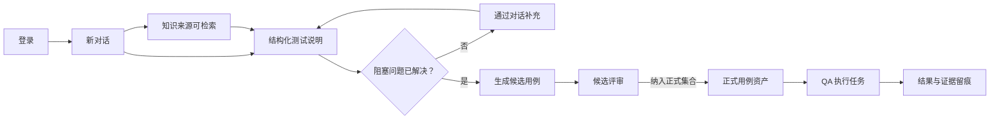

# CasePilot V1.0 端到端交互规格

> 版本：V1.0
> 日期：2026-07-30
> 状态：与端到端测试、当前实现和 Figma V1.0 同步
> Figma：[端到端原型](https://www.figma.com/design/fRnEKJHcshgCIa1CmYXbLx?node-id=165-38) · [组件页](https://www.figma.com/design/fRnEKJHcshgCIa1CmYXbLx?node-id=165-30)

## 1. 交互真相与优先级

V1.0 不再从历史方案反推行为。交互定义按以下优先级同步：

1. 可重复运行的 Playwright 端到端测试；
2. 当前 Web、API 和 Agent 的实际状态机；
3. Figma V1.0 原型；
4. 本文档与 README。

当四者不一致时，先修复测试与实现，再同步设计和文档，不保留同一动作的两套叫法。

## 2. 核心闭环

必须保持的边界：

- 第一条消息自动创建会话与集合，用户不需要先理解资产模型。
- 测试说明是生成前的人工确认点，不是生成后的附属文档。
- 候选用例不是正式资产；显式“纳入正式集合”是唯一交接动作。
- 正式用例没有执行状态；结果只属于冻结了 Revision 的 Execution Run。
- 历史对话恢复完整上下文，不只是恢复消息文本。

## 3. 全局框架

### 3.1 一级导航

| 导航 | 责任 | 选中条件 |
| --- | --- | --- |
| 空间知识库 | 上传、索引和管理来源 | 当前页面是知识来源管理 |
| AI 用例工作台 | 新对话、测试说明和候选评审 | 当前处于测试设计会话 |
| 用例管理 | 正式集合与 Revision | 当前查看正式资产 |
| 执行用例 | Execution Run 与记录 | 当前查看执行任务 |

导航项只表达当前位置，不表达连接状态、生成进度或错误。正常连接不常驻提示；
只有异常影响当前操作时才展示故障信息。

### 3.2 会话历史

- 顶栏“历史记录”打开抽屉，不离开当前上下文。
- 抽屉支持搜索、新建对话和恢复最近会话。
- `Esc`、关闭按钮或点击遮罩关闭抽屉。
- 恢复会话时加载集合、测试说明版本、候选任务和当前工作台阶段。
- 新建对话回到干净的“今天想测试什么？”状态。

Figma：[Conversation History](https://www.figma.com/design/fRnEKJHcshgCIa1CmYXbLx?node-id=165-48)

## 4. 七个端到端状态

### 4.1 新对话

Figma：[New Conversation](https://www.figma.com/design/fRnEKJHcshgCIa1CmYXbLx?node-id=165-43)

页面内容：

- 标题“今天想测试什么？”；
- 多行输入框，标签为“写给 CasePilot”；
- 生成模型选择；
- 发送按钮；
- 登录与权限、支付回调、实时语音弱网等示例入口。

行为：

- 空输入不能发送。
- 第一条消息创建会话和“新对话”集合；获得标题后用会话标题重命名集合。
- 用例生成意图进入结构化测试说明；非生成意图保留在普通对话。
- 发送后输入保留在会话记录，页面刷新可恢复。

### 4.2 空间知识库

Figma：[Knowledge Ready](https://www.figma.com/design/fRnEKJHcshgCIa1CmYXbLx?node-id=165-44)

正常流程：

1. 填写来源名称并选择文件。
2. 点击“上传并建立索引”。
3. 来源经历上传、解析、索引状态。
4. 状态变为“可检索”后，才能作为测试说明的证据。

异常与降级：

- 单文件失败不影响已有来源。
- 解析失败展示文件级原因与重试入口。
- Embedding 不可用时标记“仅全文检索”，核心流程继续。
- 来源删除不修改已经冻结到 Revision 或 Execution Run 的历史引用。

### 4.3 结构化测试说明

Figma：[Structured Brief](https://www.figma.com/design/fRnEKJHcshgCIa1CmYXbLx?node-id=165-45)

测试说明至少包含：

- 测试对象；
- 目标用户或角色；
- 范围与不在范围；
- 成功标准；
- 风险与边界；
- 知识来源引用。

阻塞规则：

- 缺少测试对象或成功标准时，显示明确的阻塞问题。
- “确认并生成用例”保持不可用，不能用通用错误替代。
- 用户在左侧对话继续补充；Agent 更新测试说明版本。
- 阻塞问题全部解决后，按钮变为可用。
- 点击确认固定当前测试说明版本并开始候选生成。

### 4.4 候选评审

Figma：[Candidate Review](https://www.figma.com/design/fRnEKJHcshgCIa1CmYXbLx?node-id=165-46)

布局：

- 左栏：候选列表、编号、优先级和步骤数；
- 中栏：结构化用例详情与来源；
- 右栏：数量、覆盖、断言和来源概览；
- 顶部：列表/脑图切换与“纳入正式集合”。

行为：

- 生成结果首先只存在于候选区。
- 列表和脑图读取同一份候选数据。
- 用户可修改标题、前置条件、步骤、预期结果、标签和来源。
- 修改不会影响正式用例。
- “纳入正式集合”批量创建正式用例及 Revision，然后自动进入用例管理。
- 重复点击必须幂等，不能创建重复正式用例。

### 4.5 正式用例管理

Figma：[Formal Case Library](https://www.figma.com/design/fRnEKJHcshgCIa1CmYXbLx?node-id=165-47)

布局：

- 左栏为集合；
- 中栏为正式用例列表与搜索；
- 右栏为结构化详情、来源和修订信息。

行为：

- 只展示已纳入正式集合的用例。
- 搜索覆盖名称、编号、模块和标签。
- 编辑创建新 Revision，不覆盖旧版本。
- 刷新后集合、当前 Revision 和搜索结果可重新加载。
- 列表和脑图是同一资产的不同视图。
- “开始执行”只对正式用例可用。

### 4.6 历史记录抽屉

历史项展示标题、阶段摘要和最近更新时间。选择一个历史项：

- 测试说明阶段恢复到对应版本；
- 候选阶段恢复任务与候选数据；
- 已交接阶段可进入正式集合；
- 运行中的任务继续订阅事件，不重新创建任务。

### 4.7 QA 执行

Figma：[QA Execution](https://www.figma.com/design/fRnEKJHcshgCIa1CmYXbLx?node-id=165-49)

创建执行任务时冻结集合中的用例 Revision。执行页包含：

- 执行队列与当前用例；
- 前置条件；
- 一一对应的步骤与预期结果；
- 通过、不通过、跳过、堵塞；
- 实际结果、证据和缺陷引用；
- 操作人、时间与并发版本。

结果语义：

| 结果 | 含义 | 必填信息 |
| --- | --- | --- |
| 未执行 | 当前 Run 尚未执行 | 无 |
| 通过 | 当前 Revision 和环境下符合预期 | 操作人、时间 |
| 不通过 | 实际结果偏离预期 | 实际结果，建议缺陷引用 |
| 跳过 | 本次 Run 不执行 | 跳过原因 |
| 堵塞 | 环境、数据或依赖阻断 | 原因与解除条件 |

历史执行永远引用当时冻结的 Revision，后续资产编辑不改写历史结果。

## 5. 状态与反馈

### 5.1 生成状态

前台展示真实阶段，不使用一个无限旋转图标代表全部工作：

1. 准备上下文；
2. 分析需求；
3. 生成测试说明；
4. 等待阻塞澄清或人工确认；
5. 生成候选用例；
6. 质量检查；
7. 等待候选评审。

刷新后从服务端任务状态恢复。超时、取消或局部失败保留已完成产物。

### 5.2 状态标签

状态不能只靠颜色表达。V1.0 组件统一使用浅底色、色点和文字：

- Neutral：待处理、未执行；
- Success：可检索、正式资产、通过；
- Warning：需评审、执行中、降级；
- Danger：失败、不通过。

### 5.3 人工门禁

以下动作必须显式发生：

- 确认结构化测试说明；
- 纳入正式集合；
- 修改正式用例并创建 Revision；
- 创建 Execution Run；
- 记录执行结果。

AI 不得绕过门禁直接修改正式资产或写入执行结果。

## 6. 原型连接

V1.0 Figma 原型从 [New Conversation](https://www.figma.com/design/fRnEKJHcshgCIa1CmYXbLx?node-id=165-43)
启动，核心连接为：

- 发送 → 结构化测试说明；
- 历史记录 → 历史抽屉；
- 确认并生成用例 → 候选评审；
- 纳入正式集合 → 正式用例管理；
- 开始执行 → QA 执行；
- 四个一级导航在各状态间跳转。

## 7. 端到端验收

自动化必须覆盖：

1. 登录后进入新对话。
2. 知识来源上传并达到可检索或明确降级状态。
3. 含歧义需求产生阻塞问题。
4. 对话补充后确认按钮可用。
5. 确认测试说明后生成结构化候选。
6. 候选纳入正式集合后可搜索和打开。
7. 刷新后正式集合与 Revision 仍存在。
8. 正式用例可创建执行任务并记录结果。
9. 页面无未处理的浏览器错误。

测试文件：

- `apps/web/e2e/agent-knowledge-flow.spec.ts`
- `apps/web/e2e/doubao-voice-flow.spec.ts`
- `apps/web/e2e/doubao-voice-real-model.spec.ts`

## 8. V1.0 不包含

- 自动生成或运行浏览器/API 测试脚本；
- Jira、ADO、Confluence、Drive 等外部连接器；
- AI 自动发布正式用例；
- 把“最近执行结果”写成正式资产状态；
- 缺陷系统双向同步；
- 多人实时共同编辑同一候选或脑图。
