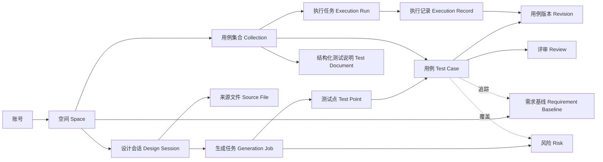

# CasePilot 完整工作流与功能模块交互设计

> 版本：V1.5
> 日期：2026-07-27
> 状态：开发验收同步稿
> 关联文档：[产品规格书 V1.5](./product-spec-v1.md)、[产品设计 V1.5](./product-design-v1.md)、[产品逻辑 Review V2.1](./product-logic-review-v1.4.md)

## 1. 本次更新结论

V1.5 将产品主流程收敛为一个可恢复、可追踪、必须人工确认的闭环：

`选择空间 → 创建/选择用例集合 → 对话与上传 → 文件解析 → 风险识别 → 测试点生成 → 脑图与文本用例生成 → 编辑/AI 改写 → 人工评审 → Revision/Baseline 发布 → 结构化测试说明 → 发布/导出 → 创建 QA 执行任务`

本次补齐：

- 对话框支持多文件队列、混合格式、单文件失败重试和解析结果确认。
- 生成过程增加风险识别、分阶段进度、取消、断点恢复和局部重试。
- 脑图支持测试点与用例节点的增删查改、移动、复制、批量操作和软删除。
- 节点支持自然语言改写，并以候选差异而不是直接覆盖的方式应用。
- 空间作为最高资产边界，用例集合必须在当前空间创建。
- 结构化测试说明与脑图、列表共用同一份结构化数据。
- 用例集合与用例资产没有 QA 执行状态；评审结论保存为 Review Event，发布状态属于 Revision/Baseline，五种 QA 结果只保存到具体 Execution Record。
- 首页和集合工作台共用模型选择；模型选择跟随生成任务而不是消息气泡。
- 正常连接状态不常驻顶部；只在检查中、降级或离线影响当前操作时提供故障反馈。
- 底部浮动控件采用统一安全间距，不贴近浏览器或系统边缘。
- QA 可创建独立任务并逐条执行；本次结果只写入当前 Run，并即时更新运行进度。

## 2. 产品对象与边界

核心约束：

- 空间决定成员、权限、编号规则、术语表、模型配置和资产可见范围。
- 用例集合是组织容器；删除集合不直接物理删除用例。
- 脑图、用例列表和测试说明只是同一对象模型的不同视图，不保存三份数据。
- AI 生成或改写只产生 `Candidate Revision`，人工接受后才写入新的用例版本。
- 平台保存权威资产、版本、评审事件、执行任务和审计；本地 Agent 只能提交候选变更。

## 3. 端到端用户流程

### 3.1 正常流程

1. 用户从顶部空间选择器进入目标空间。
2. 用户选择已有用例集合，或在当前空间创建集合。
3. 用户在聊天框输入测试目标，上传一个或多个需求、表格、截图或链接。
4. 系统把文件加入队列，逐个校验格式、大小、重复项和安全性。
5. 用户点击发送；系统并行执行文本提取、表格解析、OCR、章节切分和来源定位。
6. 系统展示解析摘要、缺失信息和来源，必要时向用户追问。
7. AI 识别业务规则、角色、歧义、依赖、冲突和风险；高风险项进入人工确认点。
8. 用户确认风险处理方式和生成范围。
9. 系统依次生成测试点、结构化用例和测试说明草稿，前台显示阶段与数量进度。
10. 用户在脑图中浏览、搜索、增删改、拖拽和批量管理节点。
11. 用户可对单节点、子树或多选节点发起自然语言改写。
12. 系统展示字段级差异；用户逐条接受、全部接受或拒绝。
13. 候选用例进入评审；通过后形成新的 Published Revision/Baseline，不产生 QA 执行结果。
14. 负责人通过评审后发布集合版本，生成结构化测试说明并导出。
15. QA 另行创建执行任务，冻结本次运行使用的 Revision 并记录本次结果。

### 3.2 关键异常分支

| 异常 | 系统行为 | 用户操作 | 数据处理 |
|---|---|---|---|
| 单文件解析失败 | 其他文件继续解析，显示失败原因 | 重试、移除、替换文件 | 保留原文件记录和错误日志 |
| 需求信息不足 | 暂停受影响分支，生成追问 | 回答问题或按假设继续 | 假设必须进入风险与审计记录 |
| 用户取消生成 | 停止后续阶段 | 保存草稿或放弃 | 已完成资产和检查点保留 |
| 模型/服务失败 | 显示失败阶段和重试建议 | 重试当前阶段或更换模型 | 不清空已完成结果 |
| 编辑冲突 | 展示双方差异 | 合并、覆盖自己的草稿或取消 | 不覆盖已发布版本 |
| 依赖环境不可用 | 当前 Execution Record 标记为堵塞 | 填写依赖与恢复条件 | 解除后在当前任务中回到未执行 |

## 4. 功能模块交互设计

### 4.1 空间选择与切换

**入口**：全局顶部空间选择器。

**默认状态**：显示当前空间、当前项目或集合上下文；最近使用空间优先。

**交互**：

1. 点击选择器后展示搜索、最近空间、全部空间和“创建空间”。
2. 切换前检查未保存的聊天输入、节点编辑和候选改写。
3. 有未保存内容时提供“保存草稿并切换”“放弃并切换”“取消”。
4. 切换成功后，需求、会话、集合、成员、视图筛选和模型配置全部刷新。

**权限**：无权限空间不展示；访问被收回时进入只读提示，不缓存其内容到新空间。

### 4.2 用例集合管理

**能力**：查看、新建、搜索、筛选、编辑、删除、导入、查看历史。

**新建集合**：名称、说明、目标、标签、负责人为首屏字段；编号规则、默认评审人和执行环境放在高级设置。

**约束**：

- 集合只能创建在当前空间；创建按钮明确写为“在当前空间新建集合”。
- 同空间名称实时校验，但允许不同空间重名。
- 删除集合采用软删除；仍被其他集合引用的用例不删除。
- Excel 导入先预览、映射、去重和校验，确认后才写入集合。

**列表视图**：

- 标题、集合说明、资产摘要、搜索/视图切换工具栏和内容区按顺序自然排布；摘要与工具栏分隔线之间保留安全间距，不允许遮挡。
- 父工作区负责列表页纵向滚动，表格与右侧详情跟随同一页面滚动；脑图模式保持固定画布。
- 每页展示 20 条用例，分页区显示“第 N / M 页 · 每页 20 条”及上一页、下一页。
- 第一页禁用“上一页”，最后一页禁用“下一页”；只有一页时两个方向均禁用。
- 搜索或切换集合后自动返回第一页；结果减少时自动使用最后一个有效页。
- 搜索结果数量展示总匹配数，而不是当前页条数；选中用例的详情不因翻页被修改。

### 4.3 对话框与多格式文件上传

**支持格式**：DOCX、PDF、XLSX、XLS、CSV、Markdown、TXT、PNG、JPG、URL。旧版 DOC 提示转换。

**文件队列交互**：

- 拖拽、文件选择器和粘贴截图均可加入队列。
- 每个文件展示名称、类型、大小、解析状态、移除和重试。
- 同名或内容相同文件提示重复，不静默覆盖。
- 单文件失败不阻断其余文件；发送前允许只使用已成功文件。
- 解析后展示页数/工作表、识别章节、来源定位和缺失内容。

**聊天行为**：

- `Enter` 发送，`Shift + Enter` 换行。
- 首页与集合工作台显示同一个模型选择器；切换模型后当前会话后续任务使用新模型，已完成任务保持原模型快照。
- “自动选择”由平台路由；“Test Design Pro”偏向复杂需求和风险分析；“本地模型”只在本地推理服务可用时启用。
- 生成中新增消息时询问“补充当前任务”或“排队到当前任务之后”。
- 选中脑图节点时，输入框显示作用范围；用户可改为整张脑图。
- 空消息、全失败文件或无权限集合不能发送，并给出修复动作。

### 4.4 风险识别中心

**风险类型**：歧义、缺失、规则冲突、边界未定义、依赖不可用、安全/合规、不可测试性。

**展示字段**：严重度、标题、说明、需求来源、影响范围、AI 置信度、处理状态、负责人。

**交互**：

- 高风险默认置顶并在继续生成前要求确认。
- 用户可“接受风险”“补充说明”“忽略”“转为待确认问题”。
- 忽略高风险必须填写原因；没有直接证据的风险标记为“AI 推测”。
- 点击来源跳转到原文页码、段落、表格单元格或聊天消息。
- 风险被需求修订解决后，不删除原记录，而是标记为已解决并关联新基线。

### 4.5 生成任务与进度

**阶段**：文件解析 → 上下文规范化 → 风险识别 → 测试点生成 → 用例生成 → 质量检查 → 文档草稿。

**进度展示**：当前阶段、完成阶段、数量进度、已用时间、预计剩余时间和可恢复检查点。

**交互规则**：

- 用户可取消任务；取消后选择保存已完成草稿或放弃未发布资产。
- 单阶段失败只重试该阶段，不能重新消耗已成功阶段。
- 页面刷新后从任务 ID 恢复状态。
- 脑图可以增量出现，但生成中的节点必须显示占位状态。
- 任务完成后显示新增、修改、风险和未覆盖项摘要。

### 4.6 脑图生成与自然交互

**层级**：集合/需求基线 → 模块 → 测试点/共同前置条件 → 用例。前置、步骤、校验点默认在详情面板展示，避免脑图过密。

同一模块下至少两条叶子用例包含完全相同的前置条件时，视图自动生成“共同前置条件”节点。每条用例最多归入一个复用次数最高的共同条件，未匹配的用例保持直接连接。该节点是数据投影，不替代用例 Revision 内的原始前置条件。

**基础交互**：

- 单击选中并打开详情；双击进入标题编辑。
- 滚轮或触控板双指滑动平移画布且不改变缩放比例；捏合手势和工具栏负责缩放。
- 所有非叶子节点支持隐藏/显示其叶子；工具栏支持一键隐藏或显示全部叶子。
- 节点支持展开、折叠、搜索定位和一键适应画布；隐藏仅改变视图状态。
- 各层节点保持清晰的横向列间距，连接线需留出足够长度以表达树形层级。
- 拖拽改变组织关系；需求追踪关系不随拖拽自动改变。

**选中节点工具栏**：AI 改写、编辑、添加子节点、复制、移动、删除。

**可访问性**：所有脑图操作必须有列表视图和键盘等价操作，颜色不能作为节点状态的唯一提示。

### 4.7 脑图节点增删查改

| 操作 | 交互 | 校验与结果 |
|---|---|---|
| 新增 | 选择父节点后新增测试点或用例 | 校验层级、名称和必填字段，创建草稿版本 |
| 查看 | 点击节点打开右侧详情 | 显示来源、版本、评审和自动化绑定；不显示历史 QA 结果 |
| 修改 | 内联改名或在详情面板编辑字段 | 保存前展示改动摘要并生成新修订 |
| 删除 | 节点工具栏或批量菜单 | 软删除；有关联或子节点时二次确认 |
| 移动 | 拖拽或“移动到”菜单 | 保留稳定 ID，记录父子关系变化 |
| 复制 | 复制到本集合、其他集合或其他空间 | 跨空间复制生成新 ID，不继承权限与审计 |

批量新增、移动、删除和 AI 改写均需要影响范围预览；已发布或已通过内容发生变化后必须重新评审。

### 4.8 节点自然语言改写

1. 用户选择单节点、子树或多选节点。
2. 输入改写指令，或选择“补充边界”“增加校验点”“拆分步骤”“表达更清晰”等快捷动作。
3. 系统先解释作用范围；范围不清楚时追问，不直接执行。
4. AI 输出字段级 Patch、改写理由、引用来源和影响节点数量。
5. 差异视图高亮新增、修改和删除；用户可逐字段接受、全部接受、拒绝或继续追问。
6. 接受后创建新 Candidate Revision，原 Published Revision 保持不变。
7. 用户可以立即撤销；系统保留原版本、提示词、模型和接受结果。

AI 不得自动删除已评审节点，不得直接修改发布基线，不得把低置信度推断伪装成需求事实。

### 4.9 用例详情编辑

最小字段：用例名称、前置步骤、执行步骤、校验点。建议同时包含优先级、类型、模块、测试数据、需求来源、风险来源、负责人和标签。

执行步骤与校验点采用一一对应的步骤表：

| 序号 | 执行动作 | 预期结果/校验点 |
|---|---|---|
| 1 | 用户完成的动作 | 可观察、可判定的结果 |

保存前检查：标题非空、至少一个步骤、至少一个校验点、步骤顺序合法、来源或“人工新增”原因明确。

### 4.10 人工评审

**评审事件**：提交评审、分配评审人、字段级评论、通过、驳回、撤回和发布。评审结论不复用 QA 执行结果。

**流程**：提交评审 → 分配评审人 → 字段级评论/修改建议 → 通过或驳回 Revision → 发布基线。

**规则**：

- 驳回必须填写原因并可指派修改人。
- 批量通过前展示数量、风险和缺失字段，二次确认。
- 已发布内容被修改后生成新的 Draft/Candidate Revision；旧基线保持只读。
- 每次评审保存人员、时间、结论、评论和所评审的精确版本。

### 4.11 QA 执行结果

通过、不通过、跳过和堵塞只属于某次 `ExecutionRecord`，资产页、脑图和用例详情不展示“最近一次结果”，避免将不同版本和环境的结果混为一谈。

| 结果 | 含义 | 必填信息 |
|---|---|---|
| 未执行 | 当前批次尚未执行 | 无 |
| 通过 | 当前版本与环境下符合预期 | 操作人、时间 |
| 不通过 | 当前版本与环境下出现偏差 | 实际结果；建议关联缺陷 |
| 跳过 | 仅在当前批次不执行 | 跳过原因 |
| 堵塞 | 当前批次受环境、数据或依赖阻断 | 原因、依赖和解除条件 |

结果颜色和图标仅在执行页、执行历史与执行报告中使用。每条结果必须能追溯到 `run_id`、任务描述和冻结的 `case_revision_id`。

### 4.12 结构化测试说明

**页面结构**：左侧章节目录、中间可编辑文档、右侧属性/追踪/版本/导出。

**标准章节**：

1. 摘要、目标与范围。
2. 来源需求、假设和不在范围事项。
3. 风险登记与待确认问题。
4. 测试策略、测试类型和测试点。
5. 用例矩阵与 Revision/Baseline 快照。
6. 需求—风险—测试点—用例追踪矩阵。
7. 覆盖率、缺口和阻断项。
8. 版本、评审、自动化绑定和执行结果。

**交互**：

- AI 可更新单个章节，但必须先显示差异。
- 人工确认的段落可锁定，后续 AI 更新不能静默覆盖。
- 用例或需求变化时标记受影响章节，用户选择同步。
- 发布前检查高风险、缺失关联和未评审内容；执行堵塞项属于执行报告。
- 支持 DOCX、PDF、Markdown、XLSX；草稿导出带版本和草稿标识。

### 4.13 QA 测试执行

**入口**：主导航“测试执行”；用例集管理页当前集合的“开始执行”。

**页面结构**：

- 一级“任务历史”：空间级任务统计、任务卡列表、新建任务入口；卡片展示任务描述、集合、状态、进度、结果分布、参与成员和最后更新。
- 二级“新建任务”：选择用例集合并填写任务描述。
- 二级“任务执行”：顶部展示任务、创建人、参与成员和进度；左侧为执行队列，右侧为前置条件、执行步骤、校验点、本次结果与备注。

**交互规则**：

- 主导航进入任务历史，而不是直接恢复某个集合的最近任务。
- 任务历史与活动任务每 5 秒同步，负责人可查看多人执行进度。
- 创建任务前只需填写任务描述；每次创建均生成独立 Run。
- “创建执行任务”保持可点击；任务描述为空时在字段下显示必填提示并自动聚焦输入框，不使用无反馈的禁用状态。
- 用例集合与用例资产本身没有执行状态。
- 同空间成员可以共同更新任务，队列和详情显示最后更新成员。
- 保存时校验记录基准更新时间；检测到他人抢先更新时加载最新结果并提示重试。
- QA 可逐项确认步骤，然后标记通过、不通过、跳过或堵塞。
- 不通过时要求记录实际结果；堵塞时要求记录原因和解除条件。
- 切换用例后保留当前运行内已保存结果。
- 页面统计仅由当前 Run 的 Execution Record 派生。
- 再次回归时新建 Run，不清空或覆盖历史任务。

### 4.14 脑图画布与全屏

- 脑图默认使用列表主体的全部可用高度，鼠标滚轮用于平移，不改变缩放比例。
- 画布右上角提供“全屏查看”；进入全屏后脑图占满视口并自动适配全部节点。
- 原生全屏不可用时降级为页面内全屏，`Esc` 或“退出全屏”均可恢复。
- 全屏状态仍支持缩放、适应画布、恢复 100% 和一键隐藏全部叶子。

## 5. 状态与版本模型

### 5.1 生命周期与执行结果

| 维度 | 建议字段 | 典型值 |
|---|---|---|
| 修订生命周期 | `revision_state` | draft、published、superseded |
| 生成任务状态 | `generation_status` | queued、running、completed、failed、cancelled |
| 执行任务状态 | `run_status` | active、completed、aborted |
| 任务内执行结果 | `execution_status` | not_run、passed、failed、skipped、blocked |

评审人员、评论和通过/驳回动作以 Review Event 保存；QA 结果只保存到 Execution Record。

### 5.2 版本原则

- 用例稳定 ID 不变，内容每次保存形成不可变 Revision。
- 集合发布形成 Baseline，记录包含的精确用例修订。
- AI 候选、用户接受、人工编辑、评审和执行分别形成事件。
- 删除采用 Tombstone；支持恢复和审计，不立即物理删除。
- 跨空间复制生成新稳定 ID，并保留只读来源引用。

## 6. 平台与本地 Agent 边界

| 平台负责 | 本地 Agent 负责 |
|---|---|
| 空间、成员、权限和审计 | 读取授权范围内的需求与候选任务 |
| 权威用例、版本、追踪和发布 | 在代码库中定位自动化入口和实现脚本 |
| AI 任务、风险、评审和文档 | 提交候选自动化绑定、变更摘要和证据 |
| MCP Token、限流和操作确认 | 提交候选变更，但不能直接改写已发布用例 |

破坏性操作、批量更新、发布、删除和跨空间复制必须在平台端再次确认。MCP 默认返回候选变更，不直接提交权威版本。

## 7. 验收标准

- 用户能在指定空间内创建集合并完成“上传 → 风险 → 生成 → 脑图编辑 → 评审 → 文档”闭环。
- 支持至少 8 类常用文件，单文件失败不影响其余文件。
- 生成进度可恢复，取消和重试不会丢失已完成资产。
- 脑图支持节点增删查改、移动、复制、批量操作和自然语言改写。
- AI 改写具有影响范围和字段差异，未经确认不修改权威版本。
- 用例至少包含名称、前置步骤、执行步骤和校验点。
- 集合、脑图、列表和详情不展示执行结果状态。
- 执行页只要求任务描述，每个 Run 的结果独立保存。
- 测试说明能追踪到需求、风险、测试点、用例和版本；执行报告单独引用 Run。
- 所有关键写操作保存操作者、时间、原因、版本和前后差异。

## 8. Figma 交付索引

- AI 工作台 V2.2：多文件上传、共享模型选择、风险、进度、脑图 CRUD、自然语言节点改写和底部安全间距，不展示执行结果图例。
- 完整工作流总览：9 阶段主流程、AI 流水线、人工确认点、平台资产边界与异常分支。
- 功能模块交互：6 个模块、24 个关键状态卡片。
- 用例集合 V3：空间选择、当前空间新建集合、纯资产统计、摘要安全间距和每页 20 条分页。
- 脑图全屏 V4：[大画布与全屏入口](https://www.figma.com/design/fRnEKJHcshgCIa1CmYXbLx?node-id=110-25)，覆盖默认画布、全屏进入与退出规则。
- 测试执行 V4：[任务历史看板](https://www.figma.com/design/fRnEKJHcshgCIa1CmYXbLx?node-id=102-2)、[多人协作执行详情](https://www.figma.com/design/fRnEKJHcshgCIa1CmYXbLx?node-id=77-3)和[新建任务必填校验](https://www.figma.com/design/fRnEKJHcshgCIa1CmYXbLx?node-id=111-25)。
- 结构化测试说明：目录、正文、风险、追踪、版本和导出。
