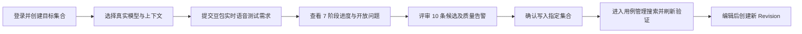

# CasePilot 产品功能 Review V2.3

> 日期：2026-07-29
> 范围：真实模型生成、候选评审、正式用例写入、用例管理与验收证据
> 场景：豆包 App 实时语音通话
> 验收模型：Qwen3.7-MAX（OpenAI Compatible）

## 1. Review 结论

“需求输入 → 真实模型生成 → 候选评审 → 指定集合写入 → 用例管理检索”的端到端动线已经跑通。真实任务完成 7 个阶段，生成并保存 10 条正式用例，覆盖通话建立、麦克风权限、插话、弱网与断网、音频路由、系统中断和隐私释放。

本轮设计不再使用 Mock 状态或虚构的满分结果。Figma V2.3 直接呈现真实验收数据：模型为 Qwen3.7-MAX、耗时约 4 分 48 秒、质量分 20、10 条覆盖矩阵告警、10 条正式用例。

## 2. 真实验收证据

| 项目 | 结果 |
| --- | --- |
| Generation Job | `4893ec24-b80b-4191-b203-142f81a86b09` |
| Provider 模式 | `openai_compatible` |
| 模型 | `Qwen3.7-MAX` |
| 阶段 | 7 个阶段全部完成 |
| 模型累计耗时 | 287,811 ms（约 4 分 48 秒） |
| 候选/正式用例 | 10 / 10 |
| 目标集合 | `c01b3143-d916-4d16-8aaf-7981aa371592` |
| 质量结果 | `passed: true`，`score: 20` |
| 质量告警 | 10 条 `requirement_coverage_gap` |
| 验收视频 | [真实模型用户动线验收视频（约 5 分 03 秒）](../artifacts/recordings/04-doubao-real-model-user-journey-acceptance.webm) |

## 3. 关键发现与产品决策

| 优先级 | 发现 | 风险 | V2.3 决策 |
| --- | --- | --- | --- |
| P0 | `passed: true` 与 `score: 20`、10 条覆盖告警同时出现 | 用户会把“结构校验通过”误解为“业务质量通过” | 将结构校验、需求覆盖和人工评审拆成独立状态 |
| P0 | 长任务约 4 分 48 秒 | 用户可能离开页面、刷新或误以为任务卡死 | 明示真实模型与阶段进度，采用 SSE 推送并以轮询恢复 |
| P0 | 写入目标依赖隐式上下文 | 多集合场景可能写错位置 | 提交与写入都携带明确 `collectionId`，写入前再次展示目标集合 |
| P1 | 候选与正式资产容易混淆 | 未评审内容可能被当作正式用例 | 候选区保持隔离，只有人工确认后才写入正式集合 |
| P1 | 旧设计显示 8 条、Mock 和虚构 100 分 | 设计证据与真实运行不一致 | V2.3 全部使用本次真实任务的 10 条结果和质量状态 |
| P1 | 写入后缺少明确交接 | 用户难以确认资产是否持久化 | 增加“前往用例管理”、搜索、刷新后保持与 Revision 入口 |

## 4. 更新后的用户动线

## 5. 核心交互规范

### 5.1 真实模型透明

- 提交前展示模型、Provider 模式、目标集合和知识来源。
- 运行中展示阶段、耗时与恢复状态，不用“处理中”覆盖全部细节。
- 页面刷新后通过任务 ID 恢复进度，避免重复创建任务。

### 5.2 候选评审与质量

- 候选用例不自动成为正式资产。
- “结构校验通过”只代表格式可用，不代表需求覆盖达标。
- 覆盖告警保留为显式审阅项；人工确认前不隐藏低分或警告。
- 列表数量、可见条目与溢出说明一致，避免“10 条但只显示 8 条”的歧义。

### 5.3 写入与管理

- 写入按钮同时显示数量与目标集合。
- 成功后提供直达用例管理的主动作。
- 用例管理支持按名称、编号、模块和标签搜索。
- 刷新后正式用例仍存在；编辑生成新 Revision，不覆盖历史版本。

## 6. Figma V2.3

- [产品 Review 与用户动线](https://www.figma.com/design/fRnEKJHcshgCIa1CmYXbLx?node-id=138-275)
- [真实模型需求输入](https://www.figma.com/design/fRnEKJHcshgCIa1CmYXbLx?node-id=138-25)
- [真实模型候选评审](https://www.figma.com/design/fRnEKJHcshgCIa1CmYXbLx?node-id=138-73)
- [正式用例管理](https://www.figma.com/design/fRnEKJHcshgCIa1CmYXbLx?node-id=138-158)

旧 V2.2 画板保留作为历史对照，V2.3 为当前产品决策与真实验收基线。

## 7. 验收标准

- 使用真实模型调用，不回退到 Mock。
- 7 个生成阶段可追踪，刷新后可恢复。
- 生成 10 条候选并保留质量分与 10 条覆盖告警。
- 人工确认后将 10 条用例写入明确的目标集合。
- 用例管理可搜索到弱网重连用例，并查看阈值、步骤、预期和来源。
- 页面刷新后数据仍存在，且可从详情创建新 Revision。
- 验收视频覆盖从需求提交、长任务等待、候选评审到正式用例管理的完整动线。
