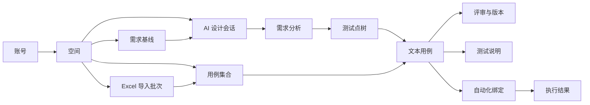
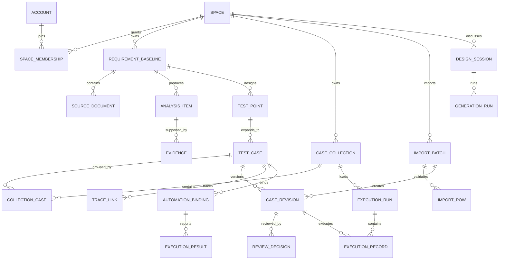
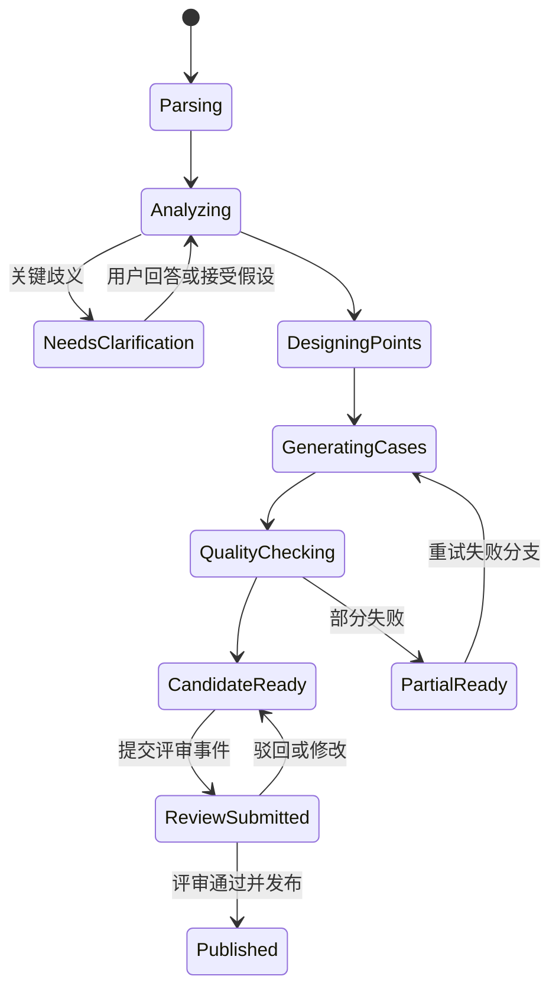

# CasePilot 产品规格书 V1.5

> 产品：AI 驱动的测试设计与文本用例管理平台
> 文档状态：开发验收同步稿
> 更新时间：2026-07-27
> 对应实现：`apps/web/`、`apps/api/`
> 读者：产品、设计、研发、测试、开源社区贡献者

## 1. 产品摘要

CasePilot 以“空间”作为测试资产的统一管理边界，将需求文档、历史 Excel 用例、自然语言讨论和测试经验转化为可追踪、可评审、可版本化的测试设计资产。用户可以在空间内管理用例集合、导入历史用例、上传需求并通过 AI 对话生成或改写用例。

核心主张不是“一键生成大量用例”，而是：

1. 让 AI 解释它理解了什么、发现了哪些歧义、计划覆盖哪些测试点。
2. 让测试人员在脑图中先评审测试设计，再进入用例细节。
3. 所有 AI 改写先产生候选版本，未经人工接受不覆盖已评审内容。
4. 用例、需求、测试点和自动化结果保持可追踪关系。
5. 同一份结构化数据可输出脑图、文本用例、测试说明和机器可读 JSON。
6. 历史 Excel 用例经过可预览、可回滚的导入流程进入空间，而不是成为不可追踪的数据副本。

## 2. 参考边界

本产品只吸收开源项目的产品与工程思想，不复制其代码或视觉资产：

- SpecifAI：参考“需求分析 → 测试点 → 用例”的 AI 工作流与需求协作体验。
- Kiwi TCMS：参考 Test Plan、Test Case、Test Run 的对象分层、评审与追踪思想。
- SpecifAI MCP Server、BrowserStack MCP Server：参考平台能力如何以窄接口暴露给本地 Agent。
- qa-skills：参考可组合的本地测试工作流和技能包形式。
- 具体结论见 [开源项目调研](./opensource-research.md)；产品体验见 [产品设计 V1.5](./product-design-v1.md)；完整工作流、状态模型与模块交互见 [产品交互设计 V1.5](./product-interaction-design.md)；工程范围、架构、接口和里程碑见 [开发基线](./development-baseline-v1.md)；本轮一致性结论见 [产品逻辑 Review V2.1](./product-logic-review-v1.4.md)。

## 3. 产品目标与非目标

### 3.1 V1 目标

- 10 分钟内从一份需求文档得到第一版测试设计脑图。
- 生成结果包含模块、测试点和结构化用例，不只是一段 Markdown。
- 每条用例至少包含名称、前置条件、执行步骤、逐步校验点、优先级和来源。
- 支持对单条或一组用例进行 AI 改写，并展示候选差异。
- 支持人工通过、驳回、修改后通过和批量评审。
- 自动生成可导出的结构化测试说明文档。
- 保留需求基线、生成批次、改写版本和评审记录。
- 以空间管理成员、用例集合、需求、AI 会话、导入批次和配置。
- 支持 Excel 历史用例导入、字段映射、重复识别、错误行修复和导入回滚。
- 支持用例集合的查看、新建、搜索、修改、删除和集合历史。

### 3.2 暂不纳入 V1

- 不做完整的自动化执行平台、设备云或浏览器云。
- 不直接在平台中运行不受信任的本地代码。
- 不把脑图当作自由绘图工具；它是测试对象关系的可视化投影。
- 不以“生成数量”作为核心质量指标。
- 不让 AI 在无人确认时自动删除或覆盖已发布 Revision。

## 4. 用户与权限

| 角色 | 主要任务 | 默认权限 |
|---|---|---|
| 测试设计者 | 分析需求、设计测试点、生成和编辑用例 | 创建、编辑、提交评审 |
| 测试负责人 | 管理测试基线、评审覆盖与风险 | 通过、驳回、发布版本 |
| 产品/研发 | 查看需求理解、补充歧义答案、参与评论 | 查看、评论、回答待确认项 |
| 自动化工程师 | 绑定脚本、同步执行结果 | 维护自动化绑定、回写结果 |
| 空间管理员 | 成员、模型、导入、数据与集成配置 | 空间全部管理权限 |

权限采用“账号 → 空间 → 测试资产”的继承模型。一个账号可加入多个空间；V1 支持 Owner、Editor、Reviewer、Viewer 四级空间角色，用例评审权可以单独授予。

### 4.1 账号注册与登录方式

当前自部署版本使用平台自有账号登录，不接入高通账号、企业 SSO 或第三方身份入口：

1. 首次使用时填写显示名称、邮箱和密码创建本地账号。
2. 后续使用邮箱和密码登录；会话使用 HttpOnly Cookie。
3. 登录成功后进入账号默认质量空间，并恢复空间、集合和生成任务上下文。
4. 正式公开版补充邮箱验证码、密码重置、登录失败限流和会话设备管理。

“无登录墙、保存时注册”作为公开演示体验候选方案保留，但不属于当前开发验收基线，避免与本地账号登录流程产生两套产品逻辑。

## 5. 产品原则

1. **先设计，后展开**：先生成测试点树，再生成具体步骤，降低大模型一次性发散。
2. **证据可见**：AI 输出必须标出需求来源、推断项和待确认项。
3. **候选变更**：AI 生成和改写默认创建 Candidate Revision；人工接受并完成评审后才能进入 Published Baseline。
4. **同源多视图**：脑图、列表和测试说明读取同一份结构化数据，不保存三套副本。
5. **空间即边界**：成员、权限、用例编号、术语表、导入数据和审计记录均归属空间。
6. **导入可回滚**：Excel 导入保留原文件、映射和批次，导入错误不能污染正式用例。
7. **人机分工明确**：平台负责权威数据、权限、版本和审计；本地 Agent 负责编码环境内的探索、脚本实现与结果提交。
8. **渐进披露**：首屏展示结构和风险，复杂的模型参数、追踪字段与版本差异按需展开。
9. **资产与执行解耦**：用例集合和用例资产不保存 QA 执行状态；每次 Execution Run 独立保存任务描述、冻结 Revision 和执行结果。

## 6. 信息架构



主导航：

- 开始设计：当前空间的全局对话入口；首次发送后创建或绑定用例集合。
- 用例集管理：查看当前空间全部用例集合，支持创建、导入和进入工作台。
- 全部用例：跨集合查看空间内正式用例与未归类用例。
- 空间：空间切换、成员、需求基线、导入记录和空间设置。
- 团队：成员、评审队列、评论与通知。
- 洞察：覆盖、风险、生成质量与执行趋势。
- 设置：模型、提示策略、集成、MCP Token、数据保留。

产品分为三个页面层级：

- 空间首页 / 全局对话：空状态输入、附件、快捷提示和最近用例集。
- 用例集管理：空间级集合的增删查改、Excel 导入和打开入口。
- 单个用例集工作台：左侧绑定集合的 AI 对话；中部脑图 / 用例列表 / 测试说明；右侧用例详情与 AI 改写。

## 7. 核心用户流程

### 7.1 从文档生成用例

1. 用户登录后进入当前空间的全局对话首页。
2. 上传 Word、PDF、Excel、Markdown、TXT 或图片；也可直接输入需求文本。
3. 用户可以选择“自动创建新用例集”或将本次对话绑定到已有集合；默认自动创建。
4. 首次发送时系统创建用例集合和主要设计会话，并进入该集合工作台。
5. 用户通过自然语言补充范围、风险偏好、目标平台和不做事项。
6. 系统完成病毒检查、文本解析、版面还原、章节切分和来源定位。
7. AI 先输出需求理解、角色、业务流程、业务规则、歧义和风险。
8. 用户回答关键歧义，或选择“按假设继续”。
9. AI 生成测试点脑图；用户可增删、合并、改名和重新生成分支。
10. AI 按已确认测试点生成文本用例。
11. 用户在右侧逐条编辑或发起 AI 改写。
12. 用户提交评审；负责人通过后发布用例基线。
13. 系统同步生成结构化测试说明并允许导出。

### 7.2 对话继续完善

支持的自然语言意图包括：

- “补充退款失败和重复退款场景。”
- “只展开支付回调分支，优先生成 P0。”
- “把所有步骤改成可直接交给新人执行的表达。”
- “找出没有异常路径的测试点。”
- “将需求 4.3.2 关联的用例整理成测试说明。”

系统在执行前展示预计影响范围；涉及批量删除、降级或改变已发布 Revision 时必须二次确认。

### 7.3 AI 改写

1. 用户选择单条用例或若干步骤。
2. 选择快捷意图：表达更清晰、补充边界、增加校验点、拆分步骤、生成测试数据；也可输入自定义要求。
3. AI 基于当前版本、需求证据、同分支用例和空间术语表生成 Candidate Revision。
4. 界面展示字段级差异、改写理由和新增/删除数量。
5. 用户接受全部、逐字段接受或放弃。
6. 接受后形成新草稿版本；若原版本已通过，必须重新评审。

### 7.4 生成测试说明

用户点击“测试说明”后，系统基于当前用例基线生成：

- 文档基本信息与需求来源。
- 测试范围、目标和不在范围内事项。
- 环境、数据和前置依赖。
- 需求分析摘要、风险与待确认项。
- 模块与测试点覆盖。
- 关键用例及完整用例附录。
- 追踪矩阵、Revision/Baseline、评审事件和版本记录。
- 自动化绑定与最近执行结果（若有）。

支持 Markdown、JSON；后续支持 DOCX、PDF、XMind 兼容导出。

### 7.5 管理空间

1. 用户从左侧全局导航或顶部空间名称进入空间管理。
2. 查看自己有权限访问的空间及成员数、用例集合数和说明。
3. 创建空间时填写名称和说明，创建者成为 Owner。
4. 切换空间后，需求、用例集合、AI 会话、评审和配置全部随空间切换。
5. Owner 可修改空间资料或将空间移入回收站；回收站保留 30 天。

空间删除不能立即物理删除用例，恢复或永久删除均需 Owner 再次确认。

### 7.6 管理用例集合

用例集合是空间内组织用例的逻辑容器。一条用例可以属于多个集合，删除集合不会删除用例本身，而是将失去全部集合关联的用例放入“未归类”。

用户可以：

- 查看集合名称、说明、用例数、来源、完整度和最近更新。
- 搜索和筛选集合。
- 新建、修改名称与说明、删除集合。
- 将单条或批量用例加入/移出集合。
- 查看集合操作历史和导入批次。

### 7.7 导入 Excel 历史用例

1. 用户在目标空间或用例集合点击“导入 Excel”。
2. 上传 `.xlsx`、`.xls` 或 `.csv`；系统保留原文件并识别工作表、表头和数据范围。
3. 用户选择工作表，预览前 100 行，并确认字段映射。
4. 系统校验必填字段、编号冲突、步骤/校验点对应关系和重复内容。
5. 用户选择重复处理策略：跳过、覆盖草稿、创建新修订或生成新用例。
6. 系统先生成导入预览，显示可导入、重复、警告和错误行数量。
7. 用户确认后创建 `ImportBatch`；成功行进入目标集合，问题行进入待修复区。
8. 管理员可以按批次回滚，回滚只撤销该批次新增的关系与修订。

默认字段映射：

| Excel 常见列 | 平台字段 | 规则 |
|---|---|---|
| 用例编号 / ID | external_id | 可选；作为去重候选，不替代平台稳定 ID |
| 用例标题 / 名称 | title | 必填 |
| 前置条件 / 前置步骤 | preconditions | 必填；支持换行拆分 |
| 操作步骤 / 执行步骤 | steps.action | 必填；支持序号或换行拆分 |
| 预期结果 / 校验点 | steps.expected | 必填；尽量与步骤按序配对 |
| 模块 / 功能模块 | module | 可选 |
| 优先级 | priority | 可选；通过映射表归一为 P0/P1/P2 |
| 需求编号 | trace.external_requirement_id | 可选 |
| 标签 | tags | 可选；支持逗号、分号和换行分隔 |

### 7.8 QA 执行用例集合

1. QA 从主导航进入“测试执行”，查看空间内全部任务的进度、结果和参与成员；也可从用例集管理页直接发起新任务。
2. 点击新建任务，选择用例集合、填写任务描述并创建 Execution Run。
3. 系统冻结集合基线与用例 Revision，加载执行队列。
4. QA 查看前置条件、执行步骤和校验点。
5. QA 逐步确认，并标记本次执行结果。
6. 不通过或堵塞时填写实际结果与缺陷/阻塞项。
7. 页面同步更新队列状态、完成进度、结果统计和最后更新成员。
8. 多位空间成员可共同执行；发生同记录并发修改时阻止后提交者静默覆盖。

执行结果只属于指定任务描述下的 Execution Run，不得回写用例资产。

## 8. 页面规格

### 8.1 空间工作台

**目标**：在同一屏完成“对话—结构—细节”的闭环。

**布局**：

- 64px 全局导航栏。
- 300–342px AI 对话区。
- 自适应主工作区。
- 340–382px 用例详情区。

**顶部状态**：当前空间、当前集合/需求基线、待确认项和发起评审。点击空间名称可以切换或管理空间。正常运行时不持续显示“本地服务已连接”；连接异常只在影响当前操作时显示可恢复错误。

**空状态**：展示上传区、三个示例提示和支持格式，不预生成虚假数据。

**加载状态**：以五个业务阶段展示进度，而不是无限旋转：文档解析、需求分析、测试点设计、用例生成、质量检查。

**错误状态**：明确失败阶段、已保留成果、可重试范围和错误编号。

### 8.2 AI 对话区

- 支持拖拽或选择文件；单文件最大 20MB，单会话最多 20 个来源文件。
- 输入框支持多行、`Enter` 发送、`Shift+Enter` 换行。
- 输入框提供模型选择：自动选择、Test Design Pro、本地模型；首页和集合工作台共享选择。
- 生成任务必须保存 `model_id`、Provider、模型版本和参数快照，便于复现与审计。
- 消息可以引用需求段落、测试点、用例或评审评论。
- AI 回复中的结构化动作以按钮呈现，如“打开脑图”“查看 2 个歧义”“生成测试说明”。
- 显示模型名称、生成批次、消耗和数据安全提示；普通用户默认隐藏高级参数。

### 8.3 用例脑图

节点层级固定为：

`需求基线 → 业务模块 → 测试点 → 用例`

节点视觉语义：

- 灰：未展开。
- 中性实线：已保存或已发布的资产。
- 灰色虚线并显示“候选”：AI Candidate Revision。
- 琥珀：有歧义或待确认。
- 红：被需求变更影响或校验失败。

颜色不表达通过、不通过等 QA 结果。滚轮或触控板双指滑动只平移画布，捏合和工具栏才改变缩放比例。

操作：缩放、定位、全屏、折叠分支、隐藏/显示叶子、一键隐藏/显示全部叶子、选择、批量选择、新增测试点、展开用例、重新生成分支、提交评审。自由拖动仅改变视图偏好，不改变业务层级。全屏进入后自动适配节点，`Esc` 或“退出全屏”恢复原布局。

### 8.4 用例详情

必填字段：

| 字段 | 类型 | 规则 |
|---|---|---|
| 用例编号 | string | 空间内唯一，发布后稳定 |
| 用例名称 | string | 8–120 字，描述场景与结果 |
| 模块 | reference | 关联一个主模块，可有多个标签 |
| 优先级 | enum | P0 / P1 / P2 |
| 类型 | enum | 功能 / 异常 / 边界 / 安全 / 兼容 / 性能 |
| 前置条件 | string[] | 可引用环境、用户、数据和开关 |
| 执行步骤 | Step[] | 至少一步 |
| 校验点 | 每步至少一个 | 与执行动作一一对应 |
| 需求来源 | Evidence[] | 至少一个来源，推断用例可标记为无直接来源 |
| Revision | reference | 展示当前修订编号和生命周期；不保存 QA 执行结果 |

步骤支持测试数据、操作、预期结果、附件与自动化参数，但首屏只展开“操作 + 校验点”。

### 8.5 用例列表

- 默认列：编号、名称、模块、类型、优先级、标签、Revision、来源。
- 支持按需求、测试点、生成批次、风险、评审人和自动化状态筛选。
- 批量操作包括：提交评审、设优先级、添加标签、AI 改写、导出；删除已发布用例需确认。
- 列表保存个人视图，不改变空间公共字段。

### 8.6 结构化测试说明

- 文档视图是数据投影，任何段落都能定位回来源对象。
- 自动生成区和人工撰写区需要有视觉标记。
- 支持章节锁定：被锁定章节不会随自动同步覆盖。
- 导出前运行一致性校验：无来源用例、缺少校验点、失效链接、未处理歧义。

### 8.7 空间管理

- 列出空间名称、说明、成员数、用例集合数和当前空间标识。
- 支持创建、查看、修改、切换和删除空间。
- 创建/编辑采用侧栏表单，避免离开当前上下文。
- 删除空间进入回收站并显示影响范围；最后一个空间不可直接删除。
- 空间切换后，页面导航和资产统计立即更新，不混用上一空间数据。

### 8.8 用例集合与 Excel 导入

- 用例集管理是空间级独立页面，不作为单个用例集工作台页签。
- 左侧集合目录支持搜索和选择；右侧展示集合摘要、最近用例和操作历史。
- 集合支持查看、新增、修改、删除；删除前说明“删除集合不删除用例”。
- 全局对话和用例集管理页都可以创建集合，并复用同一创建命令。
- Excel 导入采用三步向导：上传文件、字段映射、导入结果。
- 字段映射页必须展示文件、工作表、总行数、可导入数、重复数和错误数。
- 导入完成页提供目标集合入口、问题行下载和批次回滚入口。
- 空间 Owner/Editor 可导入；Viewer 只能查看导入记录。

### 8.9 测试执行

- 一级页是空间级任务历史，展示任务状态、进度、结果分布、参与成员和最后更新时间。
- 新建任务页选择用例集合并填写任务描述。
- 单任务页顶部展示描述、集合、创建人、参与成员和执行进度。
- 单任务页左侧是执行队列，显示编号、优先级、模块、执行结果和最后更新成员。
- 单任务页右侧展示只读用例内容、步骤确认、实际结果和缺陷引用。
- QA 可标记未执行、通过、不通过、跳过或堵塞。
- 用例集合、用例列表、脑图和详情不展示 QA 执行状态；执行操作只修改当前 Run 的 Execution Record，不修改用例 Revision。
- 创建任务只要求选择集合并填写任务描述，不要求软件版本、构建号或测试环境。
- 任务描述为空时，“创建执行任务”仍可点击；点击后显示字段级必填提示并自动聚焦描述输入框。

## 9. 功能需求

### 9.1 文档与需求分析

- **FR-101** 支持 DOCX、PDF、Markdown、TXT 上传。
- **FR-102** 保留原始文件、提取文本、章节结构、表格和段落定位。
- **FR-103** 同一需求可创建多个不可变基线；新文件不覆盖旧基线。
- **FR-104** AI 输出业务角色、流程、规则、实体、约束、异常、非功能要求、歧义和风险。
- **FR-105** 每条分析结论关联一个或多个 Evidence；推断项标记 `inferred=true`。
- **FR-106** 用户可回答歧义，答案成为空间上下文并记录回答人。

### 9.2 测试点与用例生成

- **FR-201** 从确认后的分析对象生成层级测试点。
- **FR-202** 可对单一分支生成、续写或重新生成，不强制全量重跑。
- **FR-203** 生成用例必须符合 JSON Schema；Schema 校验失败自动修复一次，仍失败则保留错误信息。
- **FR-204** 质量检查包含重复度、步骤可执行性、校验明确性、来源完整性、同级覆盖互补性。
- **FR-205** 用户可将空间术语、模板和禁止表达保存为生成规则。
- **FR-206** 每次生成记录模型、提示版本、上下文哈希、参数、耗时和 Token 成本。

### 9.3 编辑、评审与版本

- **FR-301** 普通编辑采用乐观锁；冲突时提供字段级合并。
- **FR-302** AI 改写创建 Candidate Revision，不修改当前版本。
- **FR-303** 支持逐字段接受 AI 候选。
- **FR-304** Published Revision 被修改时创建新的 Candidate Revision，并保留原 Published Revision。
- **FR-305** 评审支持通过、驳回、修改后通过、评论和批量操作。
- **FR-306** 发布生成不可变 Case Baseline，可与测试计划绑定。
- **FR-307** 需求基线变化后，通过 Evidence 关系标记受影响用例。

### 9.4 文档输出与追踪

- **FR-401** 从统一数据模型生成 Markdown 和 JSON 测试说明。
- **FR-402** 文档章节可锁定并保留人工内容。
- **FR-403** 支持需求 → 分析结论 → 测试点 → 用例 → 自动化 → 结果的双向追踪。
- **FR-404** 导出内容包含生成声明、版本、评审人和时间。

### 9.5 自动化与结果回写（MVP+1）

- **FR-501** 用例可绑定仓库、框架、文件、测试标识符和参数映射。
- **FR-502** 同一用例可绑定多个平台或测试层级的自动化实现。
- **FR-503** CI、插件或本地 Agent 可回写 run_id、commit、environment、status、duration 和 evidence URL。
- **FR-504** 结果回写不允许隐式修改用例正文。

### 9.6 账号与身份

- **FR-601** 未登录用户访问工作台时进入本地账号登录页；登录成功后恢复原目标空间。
- **FR-602** 用户可用显示名称、邮箱和密码注册本地账号；邮箱在当前自部署基线内唯一。
- **FR-603** 登录会话使用 HttpOnly Cookie；退出登录后清除会话，不清除服务端资产。
- **FR-604** 邮箱验证、密码重置、失败限流和设备管理作为公开部署前的安全增强项。
- **FR-605** 系统不得显示企业 SSO 或第三方账号入口。
- **FR-606** 邮箱验证完成前只保留本地草稿，不创建空间成员身份。
- **FR-607** 账号注册、邮箱变更、停用和权限变化必须进入审计日志。

### 9.7 空间管理

- **FR-701** 所有需求、会话、测试点、用例、集合、评审和导入批次必须归属一个空间。
- **FR-702** 用户可创建、查看、搜索、修改、切换和删除自己有权限的空间。
- **FR-703** 空间名称在同一账号可见范围内允许重复，但通过稳定 `space_id` 区分。
- **FR-704** 新建空间的创建者自动成为 Owner；Owner 可以邀请成员并设置角色。
- **FR-705** 删除空间先进入 30 天回收站；恢复后对象 ID 和版本历史不变。
- **FR-706** API、MCP 和本地 Agent 请求必须明确携带 `space_id`，禁止依赖隐式默认空间执行写操作。

### 9.8 用例集合与 Excel 导入

- **FR-801** 空间内支持用例集合的查看、新建、搜索、修改和删除。
- **FR-802** 用例与集合是多对多关系；删除集合不删除用例和用例版本。
- **FR-803** 集合记录名称、说明、创建人、来源、用例数、完整度和最近更新时间。
- **FR-804** 支持上传 `.xlsx`、`.xls`、`.csv`，单文件默认上限 50,000 行和 50MB。
- **FR-805** 系统自动识别工作表、表头和常见列名，用户可以修改字段映射并保存为模板。
- **FR-806** 用例名称、前置条件、执行步骤和校验点是默认必填映射。
- **FR-807** 导入确认前必须生成预览，分类显示可导入、疑似重复、警告和错误行。
- **FR-808** 去重至少支持外部用例编号、标准化名称和内容指纹三种信号。
- **FR-809** 重复处理支持跳过、创建新修订、覆盖尚未发布的 Candidate Revision 和生成新用例；不得覆盖 Published Revision。
- **FR-810** 每次导入形成不可变 `ImportBatch`，保留原文件、工作表、映射、操作者、结果和错误报告。
- **FR-811** 支持按导入批次回滚；回滚不得删除导入后被人工继续修改的修订，只撤销集合关系并标记冲突。
- **FR-812** 问题行可以在平台内修复后重试，也可导出带错误原因的 Excel/CSV。

### 9.9 轻量测试执行

- **FR-901** QA 可从用例集管理页或主导航创建轻量 Execution Run。
- **FR-902** 运行按集合 Baseline 冻结用例 Revision，执行中不跟随用例内容变化。
- **FR-903** QA 可逐条保存执行步骤确认、执行结果和实际结果。
- **FR-904** 执行结果包含未执行、通过、不通过、跳过和堵塞。
- **FR-905** 不通过和堵塞支持关联外部缺陷或阻塞项。
- **FR-906** 页面汇总完成进度与各执行结果数量。
- **FR-907** 执行结果只写入 Execution Record，不得修改资产或隐式创建用例 Revision。
- **FR-908** 主导航默认进入空间级任务历史，展示全部任务的状态、进度、结果分布、参与成员和最后活动时间。
- **FR-909** 空间成员可共同执行活动任务；任务历史与活动任务应自动同步最新进度。
- **FR-910** 执行记录更新采用乐观并发控制；检测到基准更新时间变化时返回冲突，不覆盖他人的最新结果。

## 10. 核心数据模型



关键对象：

- `Space`：顶层产品管理边界，包含成员、权限、用例资产、需求和配置。
- `SpaceMembership`：账号在空间内的角色、状态和邀请来源。
- `CaseCollection`：用例的逻辑集合；不拥有用例生命周期，通过关联对象组织用例。
- `CollectionCase`：用例与集合的多对多关联，记录加入方式、顺序和加入时间。
- `ImportBatch`：一次不可变导入任务，保存原 Excel、工作表、字段映射、策略、统计和回滚状态。
- `ImportRow`：单行解析、规范化、校验、去重和导入结果，可定位回工作表与行号。
- `RequirementBaseline`：需求版本的不可变快照。
- `SourceDocument`：原文件、解析状态、文本块和安全扫描结果。
- `AnalysisItem`：规则、流程、约束、歧义、风险、假设等结构化结论。
- `TestPoint`：可组合的测试意图，包含维度、风险、父子关系和覆盖理由。
- `TestCase`：稳定身份和当前工作状态。
- `CaseRevision`：一次完整快照，记录创建来源为 human、ai_generation、ai_rewrite、import。
- `Evidence`：来源文档、段落、页码、字符范围和引用摘要。
- `GenerationRun`：输入快照、模型配置、输出、质量分和运行状态。
- `ReviewDecision`：评审人、结论、评论和所针对 revision。
- `ExecutionRun`：一次轻量人工执行运行，冻结空间、集合 Baseline、执行人和开始/结束时间。
- `ExecutionRecord`：某个 Case Revision 在该运行中的结果、实际结果、缺陷引用和执行时间。
- `AutomationBinding`：脚本位置与用例的多对多绑定。

## 11. AI 工作流

### 11.1 阶段设计



每一阶段都保存结构化中间产物，允许从失败阶段继续，不重新消耗全部上下文。

### 11.2 上下文组成

生成单条用例时仅加载：

1. 空间生成规则与术语表。
2. 当前需求基线中相关 Evidence。
3. 当前测试点及父级路径。
4. 同分支已存在用例摘要，用于去重和互补。
5. 用户本轮指令。

禁止默认加载整个空间历史对话，避免上下文污染和成本失控。

### 11.3 生成输出约束

模型必须返回符合 Schema 的 JSON，并为每个字段给出 `confidence` 和 `evidence_ids`。示意：

```json
{
  "title": "支付成功后重复回调的幂等处理",
  "priority": "P0",
  "type": "negative",
  "preconditions": ["订单状态为待支付"],
  "steps": [
    {
      "action": "重复发送同一 transaction_id 的成功回调",
      "expected": ["仅生成一次支付事件", "库存仅扣减一次"]
    }
  ],
  "evidence_ids": ["ev_4_3_2"],
  "confidence": 0.91,
  "assumptions": []
}
```

### 11.4 质量评分

AI 评分只用于提示，不代替人工评审：

- 来源完整度 20%。
- 可执行性 20%。
- 校验明确度 20%。
- 覆盖贡献 20%。
- 与已有用例重复度 10%。
- 空间规范符合度 10%。

低于空间阈值的用例保留为 Candidate Revision 并显示原因，不自动丢弃。

## 12. 版本与评审规则

### 12.1 版本层级

- 需求基线版本：用户导入和确认的需求快照。
- 用例修订版本：每次人工保存或接受 AI 候选形成一个 revision。
- 用例集基线：经过评审后发布的一组特定 revision。
- 测试说明版本：引用一个用例集基线；锁定章节另有 revision。

### 12.2 生命周期与执行结果

- Revision 生命周期：`draft → candidate → published → superseded`。
- 评审分配、评论、通过/驳回动作保存为 Review Event，不复用 QA 执行结果。
- Execution Run 生命周期：`active → completed | aborted`。
- 新建 Run 时，每条 Execution Record 初始为 `not_run`。
- 当前 Run 内可将记录标记为 `passed | failed | skipped | blocked`；解除堵塞或重新执行时可回到 `not_run`。
- 同一用例在不同 Run 中的结果互不覆盖；修改用例只创建新 Revision，不回写任何历史 Execution Record。

### 12.3 AI 变更规则

- AI 只能创建 Candidate Revision，不能直接创建 Published Revision 或发布基线。
- AI 不得删除评审意见、追踪关系和自动化绑定。
- AI 建议删除时只标记 `proposed_deletion=true`。
- 批量改写必须展示受影响用例数量和可撤销批次。

## 13. 平台、本地 Agent 与 MCP 边界

### 13.1 平台负责

- 组织、权限、审计、权威数据和版本。
- 文档存储、解析、索引和敏感信息策略。
- AI 编排、生成批次、评审和结构化导出。
- 自动化绑定元数据和执行结果仓库。

### 13.2 本地 Agent 负责

- 读取用户授权的本地仓库上下文。
- 将平台用例转换为具体测试脚本。
- 定位现有自动化测试并提出绑定建议。
- 执行本地测试、收集结果并经用户确认后回写。

本地 Agent 不持有平台数据库直连权限，不绕过评审发布用例，不默认上传源代码。

### 13.3 MCP V1 工具建议

只暴露小而稳定的任务工具：

- `spaces.list`
- `spaces.get`
- `case_collections.list`
- `case_collections.get`
- `requirements.get_baseline`
- `test_cases.search`
- `test_cases.get`
- `test_cases.propose_revision`
- `automation.propose_binding`
- `execution.report_result`
- `reviews.get_status`

写操作采用“提议—确认”模式，返回 `proposal_id`；高风险操作不能由 MCP 直接执行。所有工具必须显式接收 `space_id`，并使用空间作用域 Token、幂等键、速率限制和审计日志。

## 14. API 草案

REST 资源：

```text
GET    /v1/spaces
POST   /v1/spaces
GET    /v1/spaces/{space_id}
PATCH  /v1/spaces/{space_id}
DELETE /v1/spaces/{space_id}
POST   /v1/spaces/{space_id}/restore
GET    /v1/spaces/{space_id}/case-collections
POST   /v1/spaces/{space_id}/case-collections
GET    /v1/case-collections/{collection_id}
PATCH  /v1/case-collections/{collection_id}
DELETE /v1/case-collections/{collection_id}
POST   /v1/case-collections/{collection_id}/cases
DELETE /v1/case-collections/{collection_id}/cases/{case_id}
POST   /v1/spaces/{space_id}/imports
GET    /v1/imports/{import_id}
POST   /v1/imports/{import_id}/preview
POST   /v1/imports/{import_id}/commit
POST   /v1/imports/{import_id}/rollback
POST   /v1/spaces/{space_id}/baselines
POST   /v1/baselines/{baseline_id}/documents
POST   /v1/design-sessions
POST   /v1/design-sessions/{session_id}/messages
POST   /v1/generation-runs
GET    /v1/generation-runs/{run_id}
GET    /v1/test-points/tree
GET    /v1/test-cases
POST   /v1/test-cases/{case_id}/revisions
POST   /v1/revisions/{revision_id}/reviews
POST   /v1/case-baselines
GET    /v1/test-documents/{baseline_id}
POST   /v1/automation-bindings
POST   /v1/execution-results
POST   /v1/accounts/registration-codes
POST   /v1/accounts
POST   /v1/accounts/verify-email
```

长任务返回 `202 Accepted + run_id`，前端通过 SSE 接收阶段事件：

```text
run.started
document.parsed
analysis.item.created
clarification.required
test_point.created
test_case.created
quality.issue.detected
run.completed
run.failed
import.parsed
import.preview_ready
import.row_failed
import.completed
import.rolled_back
```

## 15. 非功能需求

- **性能**：工作台首屏 P75 小于 2.5 秒；脑图 500 节点内交互保持 45 FPS；普通保存 P95 小于 800ms。
- **可恢复**：生成任务中断后可从最后成功阶段继续；用户输入本地暂存。
- **安全**：文件病毒扫描、静态解析隔离、租户隔离、最小权限、传输与静态加密。
- **Excel 导入**：工作簿解析在隔离环境完成；禁止执行宏、外部链接、公式或嵌入对象，只读取缓存值与单元格文本。
- **导入性能**：10,000 行用例在 P95 60 秒内生成预览；超大文件采用异步任务并支持断点续传。
- **身份**：账号注册采用一次性邮箱验证码；验证码短时有效、限制尝试次数并防止枚举邮箱；敏感写操作执行服务端权限检查。
- **隐私**：空间可配置是否允许第三方模型、是否用于日志、数据保留期限和区域。
- **审计**：生成、改写、导入、评审、发布、绑定、回写均记录操作者和对象版本。
- **可访问性**：目标 WCAG 2.2 AA；全键盘可操作；状态不只依赖颜色；支持减少动效。
- **可观测性**：按 run_id 串联解析、检索、模型调用、校验和存储链路。
- **成本**：大任务按分支生成；缓存解析与检索；显示生成成本估算和空间预算阈值。

## 16. 指标

北极星指标：**每周被人工通过且有需求追踪的有效用例数**。

辅助指标：

- 文档上传到首个测试点脑图的中位时间。
- 生成用例的通过率、修改后通过率和驳回率。
- AI 改写接受率及撤回率。
- 无来源、无校验点、重复用例占比。
- 需求变更影响识别覆盖率。
- 自动化绑定率和执行结果回写成功率。
- 单条最终被人工接受用例的模型成本。
- 活跃空间数、空间内有效用例集合数。
- Excel 导入成功率、映射复用率、重复命中率和问题行修复率。

避免把生成数量、Token 消耗或会话长度当作成功指标。

## 17. MVP 交付范围

### 17.1 必须交付

- 空间管理、空间成员角色与需求基线。
- 用例集合查看、新建、搜索、修改和删除。
- Excel/CSV 历史用例导入、字段映射、预览、问题行和导入批次记录。
- DOCX、PDF、Markdown、TXT 上传与解析。
- 空间内 AI 对话和五阶段生成流程。
- 需求分析、歧义与风险列表。
- 测试点脑图、用例列表和用例详情。
- AI 单条改写、字段差异、接受与放弃。
- 人工评审与用例修订历史。
- Markdown、JSON 测试说明导出。
- 基础 REST API、审计日志和模型配置。
- 本地账号注册与登录、会话恢复和退出登录。

### 17.2 下一阶段

- MCP Server 与本地 Coding Agent。
- GitHub/GitLab 仓库绑定、pytest/Playwright/JUnit 适配器。
- CI 执行结果回写。
- DOCX、PDF、XMind 导出。
- 需求差异与受影响用例建议。

## 18. MVP 验收标准

1. 未登录用户进入本地账号登录页；登录成功后进入默认质量空间。
2. 用户可以注册本地账号，并创建、查看、切换、修改和删除空间；不同空间的数据不混用。
3. 刷新页面后会话与原目标空间可恢复；退出登录后受保护页面不可继续访问。
4. 用户可以查看、新建、搜索、修改和删除用例集合；删除集合不会删除用例。
5. 上传包含 1,000 条历史用例的 Excel 后，可选择工作表并调整字段映射。
6. 导入确认前能看到成功、重复、警告和错误行统计，确认后生成可回滚批次。
7. 上传包含标题、段落和表格的 DOCX 后，系统能显示解析状态与来源定位。
8. 用户可在生成前指定至少一个重点风险，并在结果中看到对应分支。
9. 脑图中可以从需求基线逐层展开到用例，并点击用例打开详情。
10. 每条生成用例都有名称、前置条件、步骤、逐步校验点、优先级和来源。
11. AI 改写不会直接覆盖原用例；接受前可查看字段差异。
12. 已发布用例被修改时，旧 Published Revision 仍可查看，新内容形成独立 Candidate Revision。
13. 评审人可通过、驳回并填写意见；所有操作有审计记录。
14. 测试说明与当前用例基线一致，可导出 Markdown 和 JSON。
15. 任一生成或导入阶段失败时，用户能看到失败原因并只重试失败阶段或问题行。
16. 键盘可完成主要流程，减少动效设置生效。

## 19. 当前实现说明

当前 `apps/web` 与 `apps/api` 使用 PostgreSQL 持久化，已实现：

- 本地账号登录、注册、会话恢复与退出登录。
- 用例集合和结构化用例 CRUD、不可变 Revision 与审计。
- 用例列表、详情和脑图双视图；脑图支持平移、缩放、全屏、分支折叠、叶子隐藏和共同前置条件投影。
- 空间级执行任务历史、任务创建、冻结 Revision、多人执行进度、五种 Run 内结果和乐观并发控制。

AI 生成、文件解析、评审发布、结构化测试说明和多格式导出仍属于路线图，不应在当前运行界面或 OpenAPI 中声明为已启用。

## 20. 需要评审者重点确认

1. 第一版是否以“测试设计脑图”作为主视图，还是以“用例列表”作为主视图。
2. 是否要求生成前必须处理关键歧义，还是允许“按假设继续”。
3. 用例步骤采用“每步一个校验点”还是“一个步骤多个校验点”。
4. 已发布 Revision 产生新 Candidate Revision 后，是否必须重新进行完整评审。
5. MVP 是否提前包含 MCP Server，还是在平台数据模型稳定后加入。
6. 首批自动化框架优先支持 pytest、Playwright 还是 JUnit。
