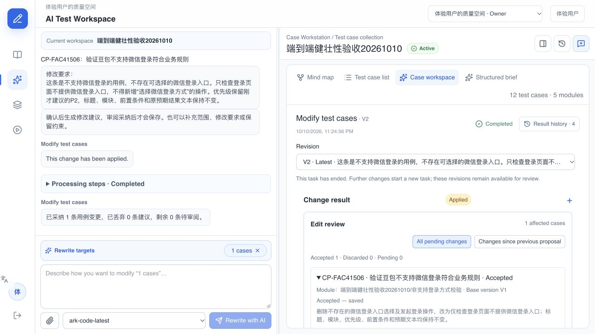

# 自然语言改写对话验收：2026-10-10

评测设计：[30组自动对话、5组端到端补充对话](../evaluations/rewrite-dialogue-v1.md)。代码基线 `709aab8a`；本次边验收边修复，下面分别保留每一轮结果，不能合并称为最终版本全量通过。

## 执行结果

模型：`doubao-seed-2.0-lite`；独立API评测并发为2。纯确认走产品快捷路径，语义理解和范围选择使用真实模型。

| 运行 | 场景实例 | 实际回复轮次 | 通过 | 失败 | 请求耗时p50/p95/max |
|---|---:|---:|---:|---:|---|
| 首轮全部30组 | 30 | 53 | 25 | 5 | 12.41s / 46.24s / 146.90s |
| 12组定向复测 | 12 | 24 | 10 | 2 | 11.13s / 36.62s / 48.91s |
| 优先级2组各独立重复3次 | 6 | 20 | 5 | 1 | 11.53s / 25.88s / 36.47s |

首轮56个计划回复，实际53个；失败后的3轮未执行。定向复测计划28轮，实际24轮。独立重复计划24轮，实际20轮。ERROR均为0；安全澄清导致功能断言失败也计入FAIL，不计通过。混合场景耗时包含失败请求，不是并发压测或稳定SLA；不同运行样本不同，不能据此宣称性能提升。

API评测运行在独立进程，准备阶段离线建立初始预览；启用真实模型配置，语义理解及范围选择调用真实模型，纯确认使用产品快捷路径。队列提交被捕获，核对实际任务提示和目标，但不运行worker；不能把这一层称为真实改写内容端到端。每组创建独立账号与空间，运行结束清理本轮fixture。

## 首次失败与修复

| 场景 | 首次现象 | 处理与复测 |
|---|---|---|
| RW-09 | 优先级赋值遇到模型响应异常，安全澄清 | 复测通过；保留首次失败，具体供应商异常原因未定位 |
| RW-16 | 当前范围加上另一模块用例，被引用范围子集校验阻挡 | 明确追加是并集，扩大引用使用reference=none；复测通过 |
| RW-23 | “先删掉B，再改其余”被偷换为改写范围排除B | 增加额外任务意图校验，先澄清删除整条用例意图；复测通过 |
| RW-24 | “同时生成十条”混入改写要求 | 生成新用例意图必须澄清，不能默默并入改写；复测通过 |
| RW-29 | 已补充“步骤更清晰”，仍再次询问修改方向 | 已明确的草稿要求阻止重复澄清；复测通过 |

定向复测又发现两种不稳定解释：RW-10仅赋值P0时又询问目标；RW-26纠正为P2并说不要P0时，误排除当前P0用例。补充默认沿用当前全部范围、旧赋值纠正不等于过滤范围的规则，回复理解只传用例身份和模块概要，实际范围选择仍接收完整正文。RW-10随后3次全部通过；RW-26前2次完整通过，第3次在首轮要求补充遇到模型响应异常、安全澄清，后续4轮未执行。仍不能声称稳定全量通过。

自动回归113项通过，前端类型检查通过。空结果失败时不再显示“改写完成、等待审阅”。

## 浏览器到落库的验收

在独立集合“端到端健壮性验收20261010”，仅操作合成用例CP-FAC41506：

1. 指定单条，拆步骤并保留标题、模块、优先级及预期；确认中补充前置条件保留，仍先展示预览。
2. 优先级P0纠正为P2，再用“没问题，就照这个来吧”确认，生成建议。采纳前正式用例版本未变。
3. 首轮建议新增了“选择微信登录方式”的具体UI动作，原步骤和需求未提供该入口依据，所以未直接采纳。保存首轮证据，新增合成验收约束“页面不提供微信入口”，继续改写。此约束是本轮新提供的测试依据，不把原“不支持微信登录”自动等同于绝无入口。
4. 继续改写的worker首次连接中断；界面重试回到相同范围/要求的确认预览，再确认后成功恢复。首次失败截图与数据保留。
5. 核对纠正建议为查看、核对入口，不再选择不存在的入口；保留最终P2及标题、模块、前置条件、原预期结果文本，再采纳。
6. 刷新后显示Applied/Accepted。数据库核对仅目标用例V1→V2，其他11条版本未变；V2业务字段与审阅后的建议一致。原用户会话的5条建议仍未采纳，正式版本未变。



RW-E2E-03/04/05本轮未执行，不能算通过。此次刷新验收只覆盖采纳持久化，未覆盖RW-E2E-04的完整澄清刷新组合。

## 仍需关注

- 偶发模型异常仍会让明确输入需要重试；当前安全停止，不能用安全性通过替代易用性通过。
- “当前范围是哪些”当前进入安全澄清，尚未做到直接回答并保留原确认状态。
- 改写内容可能新增缺依据的具体操作，仍须审阅来源和可执行性，不能只依据模型质量分采纳。

逐轮请求、服务端回复、实际范围、草稿、错误断言、耗时、首轮建议、失败及采纳截图保存在 `output/rewrite-dialogue-evaluation-20261010/`。首次与复测原始JSON独立保存；版本控制中的[证据索引](./evidence/rewrite-dialogue-2026-10-10/manifest.json)包含原始结果和截图。

## 复跑

```sh
PYTHONPATH=apps/api/src .venv/bin/python scripts/qa/evaluate_rewrite_dialogue.py --ids RW-10,RW-26 --repeat 3 --output output/rewrite-dialogue-evaluation/priority-repeat.json
```
