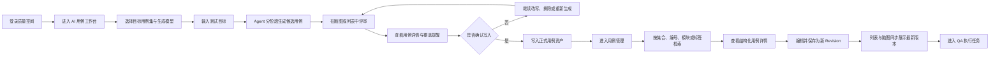

# CasePilot 用户动线与验收记录 V0.7

> 验收日期：2026-07-28
> 验收范围：AI 用例工作台、用例管理
> 验收环境：本地 Web、API、PostgreSQL、Redis、Mock Agent Worker
> 验收结论：通过

## 1. 核心用户动线

## 2. AI 用例工作台验收

| 编号 | 验收点 | 实际结果 | 结论 |
| --- | --- | --- | --- |
| WB-01 | 登录后进入聊天创建页 | 展示测试目标输入、目标集合、模型和快捷提示 | 通过 |
| WB-02 | 切换目标集合 | 从登录验收集切换到 Audio Feature 用例集，正式用例数同步更新 | 通过 |
| WB-03 | 选择生成模型 | 选择 Test Design Pro，工作区保持所选模型 | 通过 |
| WB-04 | 输入并提交测试目标 | 提交 Audio Feature 的权限、反馈、中断恢复、保存回放场景 | 通过 |
| WB-05 | 分阶段生成 | Agent 完成生成并返回 2 条候选、质量评分 100 和 1 项开放问题 | 通过 |
| WB-06 | 候选与正式资产隔离 | 候选明确标记“尚未写入正式用例集” | 通过 |
| WB-07 | 脑图与列表评审 | 两种视图读取同一批正式用例与候选用例 | 通过 |
| WB-08 | 结构化详情 | 展示编号、优先级、前置条件、步骤、校验点和来源 | 通过 |
| WB-09 | 人工门禁写入 | 主动确认后 2 条候选写入 Audio Feature 用例集 | 通过 |

## 3. 用例管理验收

| 编号 | 验收点 | 实际结果 | 结论 |
| --- | --- | --- | --- |
| CM-01 | 集合导航 | 可在登录验收集与 Audio Feature 用例集之间切换 | 通过 |
| CM-02 | 搜索过滤 | 使用“AI 候选”检索，准确返回本次写入的 2 条用例 | 通过 |
| CM-03 | 用例详情 | 选择用例后展示模块、类型、优先级、前置条件、步骤和来源 | 通过 |
| CM-04 | 版本化编辑 | 修改来源并保存，Revision 从 V1 更新为 V2 | 通过 |
| CM-05 | 视图一致性 | 过滤后的 2 条用例在列表和脑图中保持一致 | 通过 |
| CM-06 | 数据持久化 | 写入和修订均由真实 API 与数据库保存 | 通过 |

## 4. 录屏证据

- [AI 用例工作台验收录屏](../artifacts/recordings/01-ai-workbench-acceptance.webm)
  - 独立验收账号注册
  - 切换 Audio Feature 用例集与 Test Design Pro
  - 输入测试目标、生成 2 条候选
  - 切换列表、查看详情并写入正式资产
- [用例管理验收录屏](../artifacts/recordings/02-case-management-acceptance.webm)
  - 切换 Audio Feature 用例集
  - 搜索本次写入的 AI 候选
  - 查看详情、保存为 V2
  - 切换到脑图验证视图一致性

## 5. 验收边界

- 当前附件只作为本地对话上下文展示，不上传或解析文件内容。
- AI 输出默认为候选内容，不自动创建 QA 执行结果。
- QA 执行状态只属于具体执行任务，不属于正式用例资产。
- 本次录屏使用独立的“验收演示”账号，不修改示例账号已有用例。
